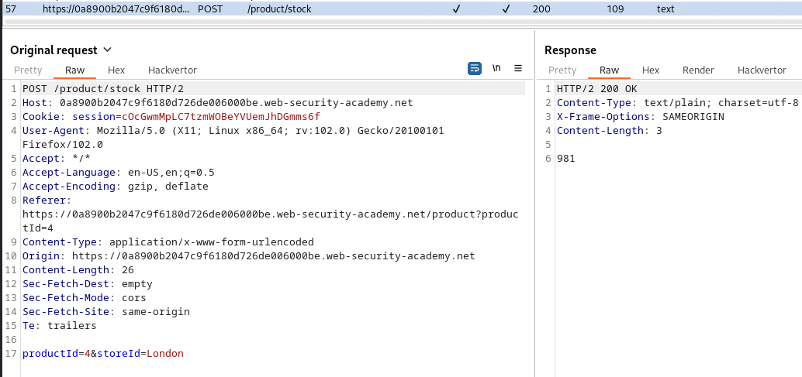
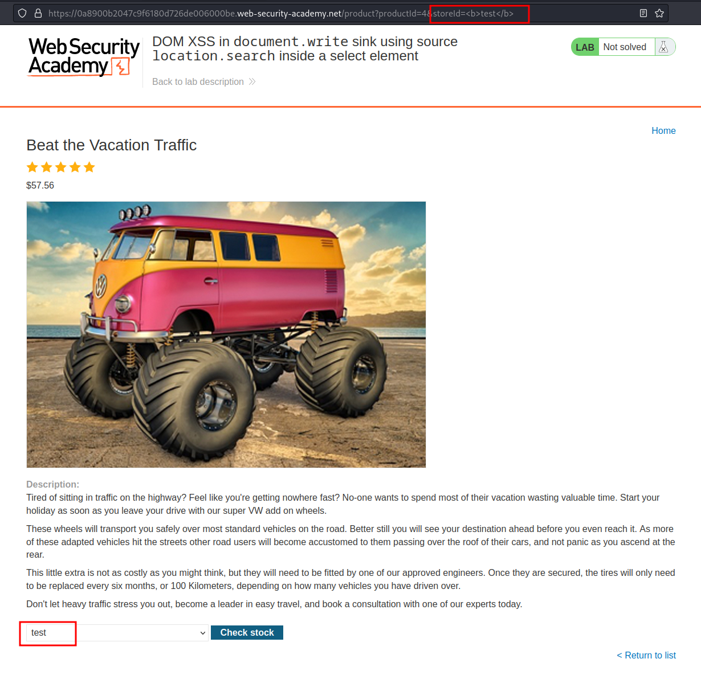
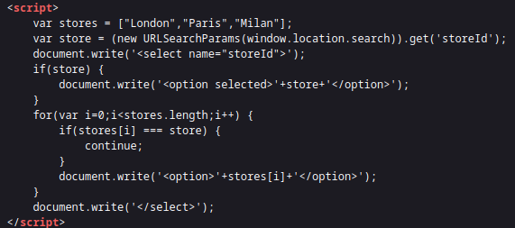
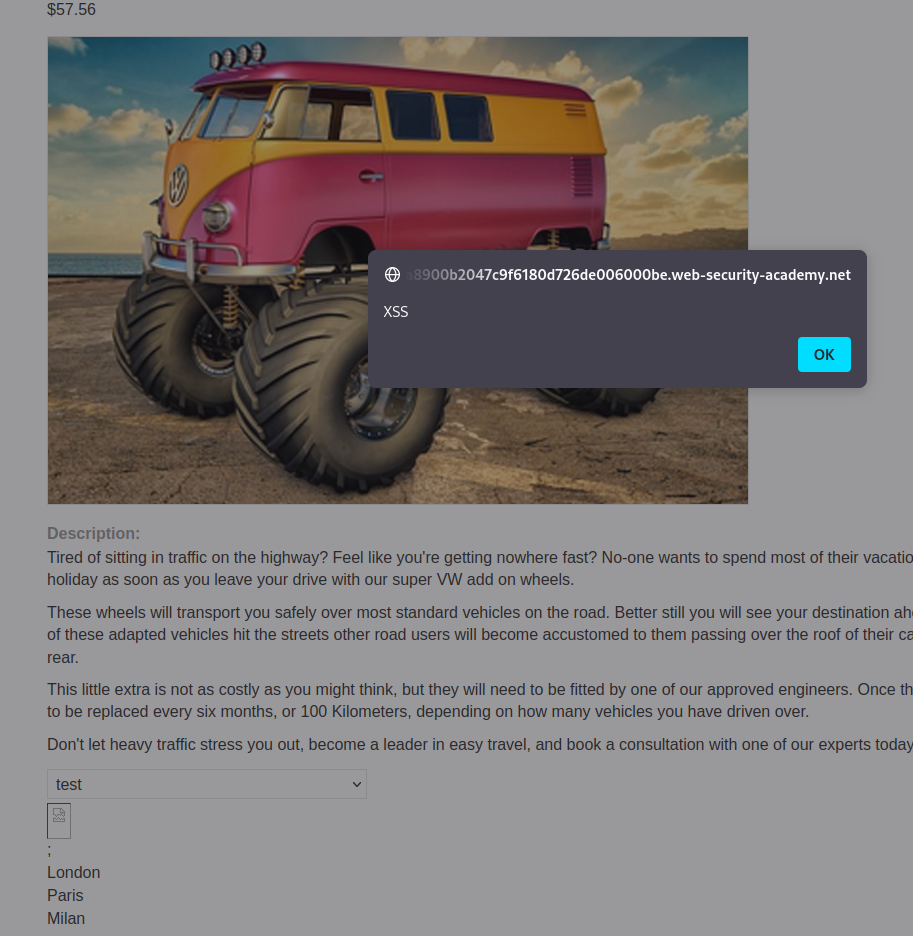

# Lab: DOM XSS in document.write sink using source location.search inside a select element

URL: https://0a8900b2047c9f6180d726de006000be.web-security-academy.net/


URL: https://0a8900b2047c9f6180d726de006000be.web-security-academy.net/product?productId=4






# Exploitation:



<br>

We have to escape the `option` and `select` tags.

Payload:

```
test</option></select>;
```

