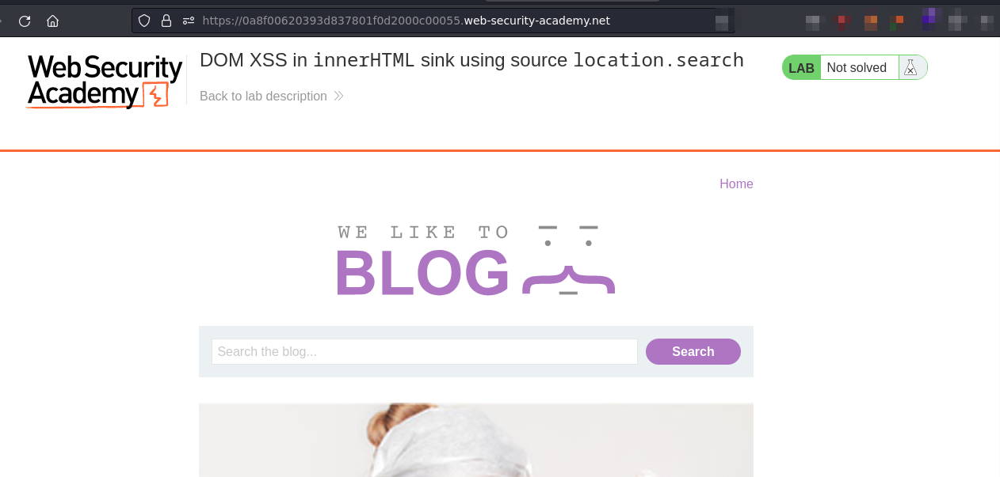
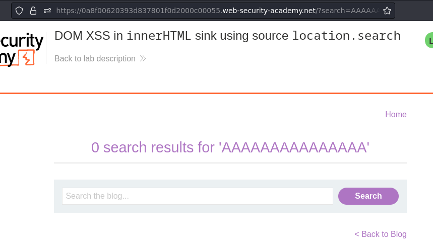
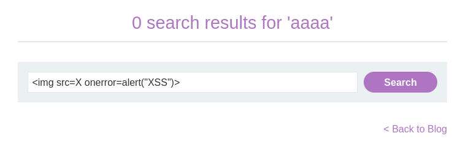
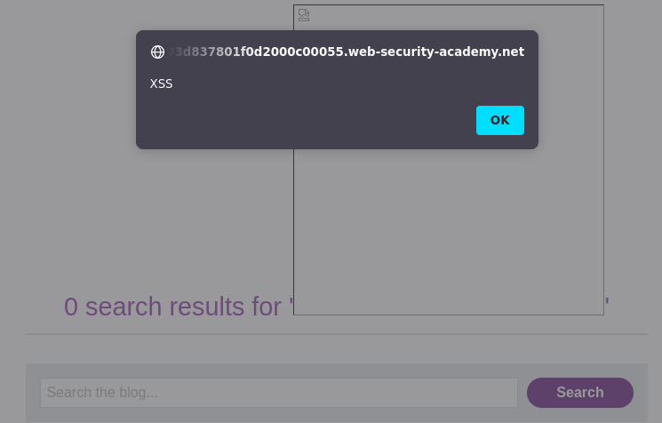

# Lab: DOM XSS in innerHTML sink using source location.search

URL: https://0a8f00620393d837801f0d2000c00055.web-security-academy.net/



## Testing the fields:



## Exploitation:





Payload:

```

```