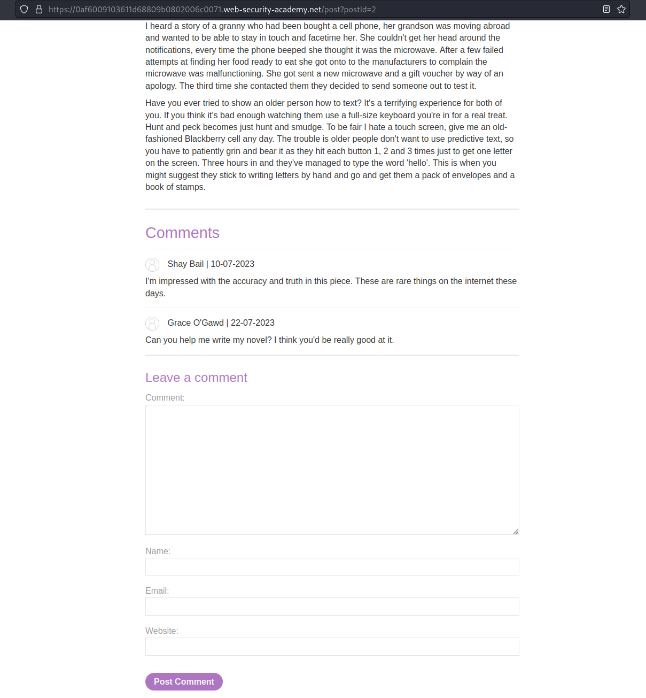
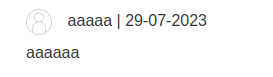
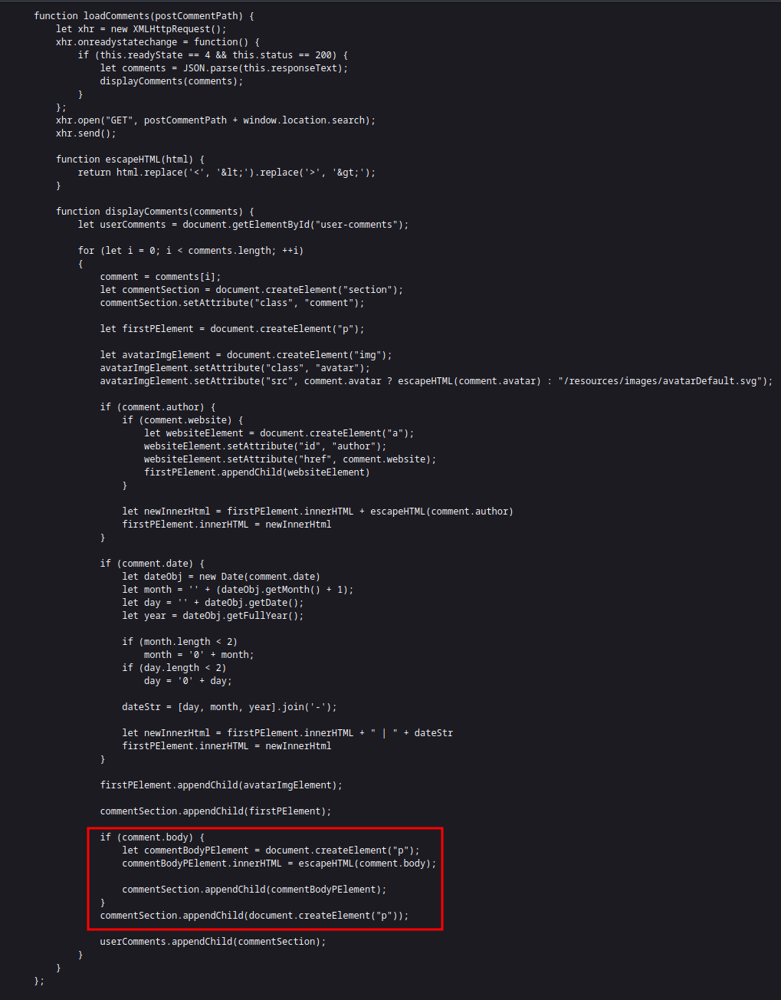
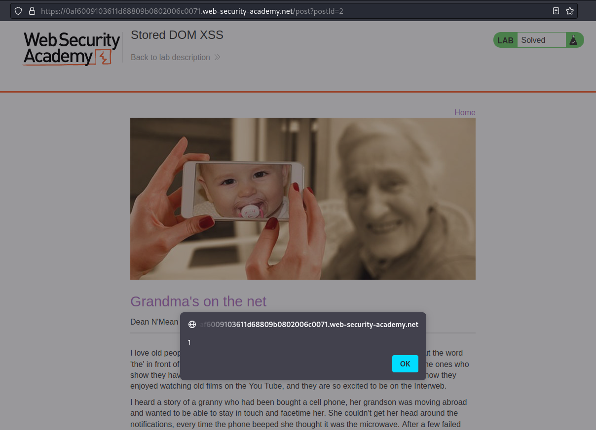
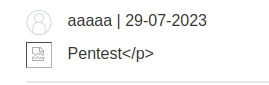

# Lab: Stored DOM XSS

URL: https://0af6009103611d68809b0802006c0071.web-security-academy.net/


URL: https://0af6009103611d68809b0802006c0071.web-security-academy.net/post?postId=2



# Testing fields:



<br>

URL: view-source:https://0af6009103611d68809b0802006c0071.web-security-academy.net/resources/js/loadCommentsWithVulnerableEscapeHtml.js



# Exploitation:

Payload:

```
Pentest</p>
```



<br>

