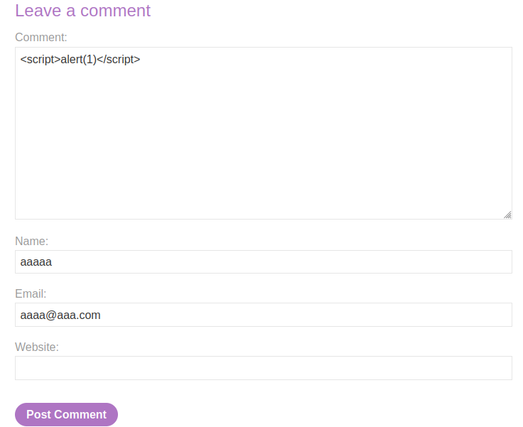

# Lab: Stored XSS into anchor href attribute with double quotes HTML-encoded

URL: https://0ad9008203b5f398873f746e00fd00b0.web-security-academy.net/

URL: https://0ad9008203b5f398873f746e00fd00b0.web-security-academy.net/post?postId=9

# Testing fields:

# Exploitation:

We will use this payload from hacktricks:

 

